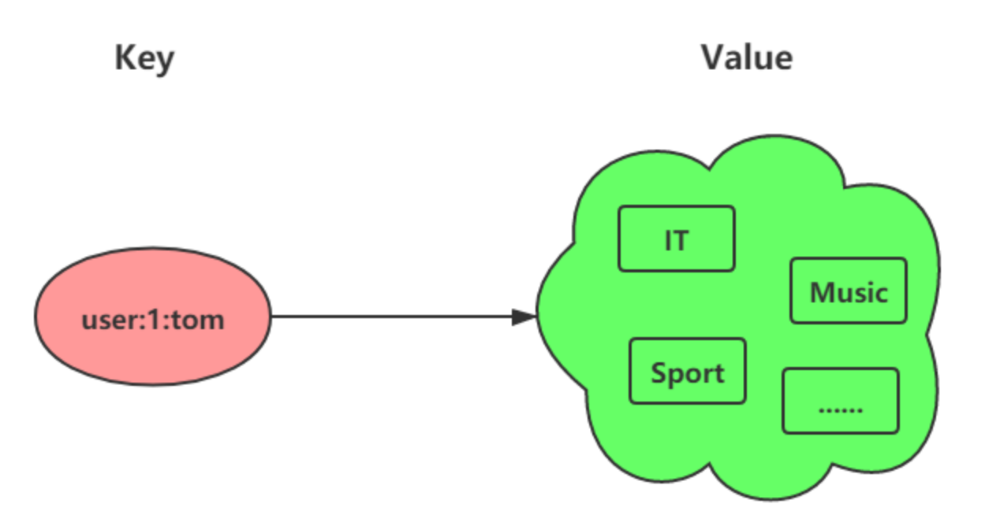

[两万字详解Redis经典面试题（珍藏版） ](https://juejin.cn/post/7002011542145204261?searchId=2023080517113332FE2592A7E2FFAAAE78#heading-45)

# redis基本认识

## 什么是redis？

Redis 是一种基于内存的数据库，对数据的读写操作都是在内存中完成，因此**读写速度非常快**，常用于**缓存，分布式锁等场景**。

对数据类型的操作都是**原子性**的，因为执行命令由单线程负责的，不存在并发竞争的问题。

Redis 还支持**事务** 、**持久化**、Lua 脚本、多种集群方案（**主从复制模式**、**哨兵模式**、切片机群模式）、**发布/订阅模式**，**内存淘汰机制**、**过期删除机制**。


## Redis 为什么这么快？

1. Redis 基于内存，内存的访问速度是磁盘的上千倍；
2. **Redis 采用 IO 多路复用，提升了并发处理的连接数**。但是IO操作都是由一个主线程处理的，redis6.0使用多个线程进行IO操作，优化IO处理能力。对数据操作仍然是单线程的，所以不需要多线程中线程切换和线程同步的开销。
3. Redis 内置了多种优化过后的数据结构实现，性能非常高。例如跳表、压缩链表

## 为什么用redis作为MySQL的缓存？

一、redis具备高性能

redis是基于内存的数据库，操作redis缓存就是直接操作内存，所以速度相当快。

注意redis与MySQL双写一致性问题


二、redis具备高并发

单台机器的redis QPS是MySQL的10倍，redis单机的QPS能轻松突破10W。

所以，直接访问 Redis 能够承受的请求是远远大于直接访问 MySQL 的。把数据库中的部分数据转移到缓存中去，这样用户的一部分请求会直接到缓存这里而不用经过数据库

QPS（Query Per Second）：服务器每秒可以执行的查询次数；


# 数据类型

## 五种常见的 Redis 数据类型是怎么实现？底层数据结构


String 是最基本的 key-value 结构，key 是唯一标识，value 是具体的值，value其实不仅是字符串， 也可以是数字（整数或浮点数），value 最多可以容纳的数据长度是 `512M`。

### String 类型

#### 内部实现

底层数据结构主要是是int和**SDS（简单动态字符串）**。SDS 相比于 C 的原生字符串：

+ **SDS 不仅可以保存文本数据，还可以保存二进制数据**。SDS 使用 len 属性的值而不是空字符来判断字符串是否结束，并且 SDS 的所有 API 都会以处理二进制的方式来处理 SDS 存放在 buf[] 数组里的数据。所以 SDS 不光能存放文本数据，而且能保存图片、音频、视频、压缩文件这样的二进制数据。
+ **SDS 获取字符串长度的时间复杂度是 O(1)**。C 语言的字符串并不记录自身长度，所以获取长度的复杂度为 O(n)；SDS 结构里用 len 属性记录了字符串长度，所以复杂度为 O(1)
+ **Redis 的 SDS API 是安全的，拼接字符串不会造成缓冲区溢出**。因为 SDS 在拼接字符串之前会检查 SDS 空间是否满足要求，如果空间不够会自动扩容，所以不会导致缓冲区溢出的问题

字符串对象的内部编码（encoding）有 3 种 ：int、raw和 embstr


1. 如果一个字符串对象保存的是整数值，并且这个整数值可以用long类型来表示，那么字符串对象会将整数值保存在字符串对象结构的ptr属性里面（将void*转换成 long），并将字符串对象的编码设置为int。

   

2. 如果字符串对象保存的是一个字符串，并且这个字符串的长度小于等于 32 字节（redis 2.+版本），那么字符串对象将使用一个简单动态字符串（SDS）来保存这个字符串，并将对象的编码设置为embstr， embstr编码是专门用于保存**短字符串**的一种优化编码方式

   

3. 如果字符串对象保存的是一个字符串，并且这个字符串的长度大于 32 字节（redis 2.+版本），那么字符串对象将使用一个简单动态字符串（SDS）来保存这个字符串，并将对象的编码设置为raw

   

embstr会通过一次内存分配函数来分配一块连续的内存空间来保存redisObject和SDS，而raw编码会通过调用两次内存分配函数来分别分配两块空间来保存redisObject和SDS。


#### 应用场景：

一、缓存对象

+ 直接缓存整个对象的 JSON。`SET user:1 '{"name":"xiaolin", "age":18}'`

+ 常规数据（比如 session、token、序列化后的对象、图片的路径）的缓存

+ 采用将 key 进行分离为 user:ID:属性，采用 MSET 存储，用 MGET 获取各属性值

  ```sql
  MSET user:1:name xiaolin user:1:age 18 user:2:name xiaomei user:2:age 20
  ```

二、常规计数

因为 Redis 处理命令是单线程，所以执行命令的过程是原子的。比如计算访问次数、点赞、转发、库存数量等等。

```sql
SET aritcle:readcount:1001 0
INCR aritcle:readcount:1001
DECR aritcle:readcount:1001
```

三、分布式锁

SETNX  命令可以实现「key不存在才插入」，可以用它来实现分布式锁：

- 如果 key 不存在，则显示插入成功，可以用来表示加锁成功
- 如果 key 存在，则会显示插入失败，可以用来表示加锁失败

加锁：

```sql
SETNX lock_key unique_value PX 10000
# PX 10000表示设置lock_key的过期时间为 10s，这是为了避免客户端发生异常而无法释放锁
```

解锁：将 lock_key 键删除，但不能乱删，要保证执行操作的客户端就是加锁的客户端。**解锁的时候，我们要先判断锁的 unique_value 是否为加锁客户端，是的话，才将 lock_key 键删除**。解锁是有两个操作，这时就需要 Lua 脚本来保证解锁的原子性，因为 Redis 在执行 Lua 脚本时，可以以原子性的方式执行，保证了锁释放操作的原子性。

四、共享session信息

对于单系统应用，直接把session保存到服务端就可以，但是对于分布式系统却不行。**对于分布式系统，需要借助Redis把session信息统一存储和管理**，这样无论请求发送到那台服务器，服务器都会去同一个 Redis 获取相关的 Session 信息。


### List 类型

List 列表是简单的字符串列表，**按照插入顺序排序**，可以从头部或尾部向 List 列表添加元素。

列表的最大长度为 `2^32 - 1`，也即每个列表支持超过 `40 亿`个元素

#### 内部实现

List 类型的底层数据结构是由**双向链表或压缩列表**实现的：

- 如果列表的**元素个数**小于 512 个（默认值，可由 list-max-ziplist-entries 配置），列表每个**元素的值**都小于 64 字节（默认值，可由 list-max-ziplist-value 配置），Redis 会使用**压缩列表**作为 List 类型的底层数据结构；其他情况都使用**双向链表**作为 List 类型的底层数据结构
- **在 Redis 3.2 版本之后，List 数据类型底层数据结构就只由 quicklist 实现了，替代了双向链表和压缩列表**。


#### 应用场景

一、**消息队列**

消息队列在存取消息时，必须要满足三个需求：**消息保序**、**处理重复的消息**和**保证消息可靠性**。

- 消息保序：使用 LPUSH + RPOP；改进：使用 BRPOP阻塞读取
- 重复消息处理：生产者自行实现全局唯一 ID；
- 消息的可靠性：使用 BRPOPLPUSH命令


**List 本身就是按先进先出的顺序对数据进行存取的**，所以用List作为消息队列保存消息的话，就已经能满足消息保序的需求。

LPUSH + RPOP （或RPUSH+LPOP）命令实现消息队列。缺点就是即使没有新消息写入List，消费者也要不停地调用 RPOP 命令，这就会导致消费者程序的 CPU 一直消耗在执行 RPOP 命令上，带来不必要的性能损失。

改进：使用 **BRPOP 命令，阻塞式读取**，客户端在没有读到队列数据时，自动阻塞，直到有新的数据写入队列，再开始读取新数据。


List是可以存重复的值的。所以我们需要给消息一个**全局ID**：

+ 每个消息都有一个全局的 ID
+ 消费者要记录已经处理过的消息的 ID。当收到一条消息后，消费者程序就可以对比收到的消息 ID 和记录的已处理过的消息 ID，来判断当前收到的消息有没有经过处理。如果已经处理过，那么，消费者程序就不再进行处理了。

例如：

```sql
LPUSH mq "111000102:stock:99" #ID为111000102
```


对于可靠性，`BRPOPLPUSH` 命令，作用是让消费者程序从一个 List 中读取消息，同时，Redis 会把这个消息再插入到另一个 List（可以叫作**备份 List**）留存。这样一来，如果消费者程序读了消息但没能正常处理，等它重启后，就可以从备份 List 中重新读取消息并进行处理了。


缺陷：

+ List 不支持多个消费者消费同一条消息。因为一旦消费者拉取一条消息后，这条消息就从 List 中删除了，无法被其它消费者再次消费。改进：Stream 数据类型的消息队列


### Hash 类型

Hash 是一个键值对（key - value）集合，其中 value 的形式如： `value=[{field1，value1}，...{fieldN，valueN}]`。Hash 特别适合用于存储对象


#### 内部实现

由**压缩列表或哈希表**实现的：

- 如果哈希类型元素个数小于 512 个（默认值，可由 hash-max-ziplist-entries 配置），所有值小于 64 字节（默认值，可由 hash-max-ziplist-value 配置）的话，Redis 会使用**压缩列表**作为 Hash 类型的底层数据结构；其他情况使用**哈希表**作为 Hash 类型的底层数据结构
- **在 Redis 7.0 中，压缩列表数据结构已经废弃了，交由 listpack 数据结构来实现了**。


#### 应用场景

一、缓存对象

Hash 类型的 （key，field， value） 的结构与对象的（对象id， 属性， 值）的结构相似，也可以用来存储对象。

```sh
HSET uid:1 name Tom age 15
HSET uid:2 name Jerry age 13
```


### Set 类型

Set 类型是一个**无序并且唯一的键值集合**，它的存储顺序不会按照插入的先后顺序进行存储。

一个集合最多可以存储 `2^32-1` 个元素。概念和数学中个的集合基本类似，**可以交集，并集，差集**等等，所以 Set 类型除了支持集合内的增删改查，同时还支持多个集合取交集、并集、差集。



Set 类型和 List 类型的区别如下：

- List 可以存储重复元素，Set 只能存储非重复元素；
- List 是按照元素的先后顺序存储元素的，而 Set 则是无序方式存储元素的

#### 内部实现

由**哈希表或整数集合**实现的：

+ 如果集合中的元素都是整数且**元素个数**小于 512 （默认值，set-maxintset-entries配置）个，Redis 会使用**整数集合**作为 Set 类型的底层数据结构
+ 否则，Redis 使用**哈希表**作为 Set 类型的底层数据结构


#### 应用场景

我们存储的数据是无序并且需要去重的情况下，比较适合使用集合类型进行存储。

Set 的差集、并集和交集的计算复杂度较高，在数据量较大的情况下，如果直接执行这些计算，会导致 Redis 实例阻塞


一、点赞：Set 类型可以保证一个用户只能点一个赞

二、共同关注：

+ 交集得共同关注

+ 差集得推荐好友

三、抽奖活动

```sh
SADD lucky Tom Jerry John Sean Marry Lindy Sary Mark
# 允许重复中奖
SRANDMEMBER lucky 1#一等奖 一个人
SRANDMEMBER lucky 2#二等奖 二个人
# 不允许重复中奖
SPOP lucky 1
SPOP lucky 2
```


### ZSet 类型

Zset 类型（有序集合类型）相比于 Set 类型多了一个排序属性 score（分值），对于有序集合 ZSet 来说，每个存储元素相当于有两个值组成的，一个是**有序集合的元素值**，一个是**排序值**。

有序集合保留了集合**不能有重复成员**的特性（分值可以重复），但不同的是，有序集合中的元素可以排序。


#### 内部实现

由**压缩列表或跳表**实现的：

- 如果有序集合的元素个数小于 128 个，并且每个元素的值小于 64 字节时，Redis 会使用**压缩列表**作为 Zset 类型的底层数据结构；否则，使用**跳表**作为 Zset 类型的底层数据结构
- **在 Redis 7.0 中，压缩列表数据结构已经废弃了，交由 listpack 数据结构来实现了**。


zset 结构体里有两个数据结构：一个是跳表，一个是哈希表。这样的好处是既能进行高效的范围查询，也能进行高效单点查询。

```c
typedef struct zset {
    dict *dict;
    zskiplist *zsl;
} zset;
```

Zset 对象在执行数据插入或是数据更新的过程中，会依次在跳表和哈希表中插入或更新相应的数据，从而保证了跳表和哈希表中记录的信息一致。

Zset 对象能支持范围查询（如 ZRANGEBYSCORE 操作），这是因为它的数据结构设计采用了跳表；而又能以常数复杂度获取元素权重（如 ZSCORE 操作），这是因为它同时采用了哈希表进行索引

#### 应用场景

需要展示最新列表、排行榜等场景时，如果数据更新频繁或者需要分页显示，可以优先考虑使用 Sorted Set

#### 

### BitMap

位图，一串连续的二进制数组（0和1），可以通过偏移量（offset）定位元素.


#### 内部实现

Bitmap 是用 String 类型作为底层数据结构。String 类型是会保存为二进制的字节数组，Redis 就把字节数组的每个 bit 位利用起来，用来表示一个元素的二值状态，你可以把 Bitmap 看作是一个 bit 数组。


#### 应用场景

一、签到统计

```sh
SETBIT uid:sign:100:202206 2 1 #6.3号签到了
GETBIT uid:sign:100:202206 2#判断6.3号是不是签到了
BITCOUNT uid:sign:100:202206#统计六月份签到次数
BITPOS uid:sign:100:202206 1#获取 userID = 100 在 2022 年 6 月份首次打卡日期
```


```sh
BITOP AND destmap bitmap:01 bitmap:02 bitmap:03
BITCOUNT destmap#统计 3 天连续打卡的用户数
```


二、用户登录状态

```sh
SETBIT login_status 10086 1 #判断 ID = 10086 的用户登陆
GETBIT login_status 10086 #检查该用户是否登陆
SETBIT login_status 10086 0 # 登出
```


### Stream

Redis 专门为消息队列设计的数据类型

在此之前，消息队列的实现方式有缺陷：

- 发布订阅模式，不能持久化，也就无法可靠的保存消息，并且对于离线重连的客户端不能读取历史消息的缺陷；
- List 实现消息队列的方式不能重复消费，一个消息消费完就会被删除，而且生产者需要自行实现全局唯一 ID


- XADD：插入消息，保证有序，可以**自动生成全局唯一 ID**；
- XLEN ：查询消息长度；
- XREAD：用于读取消息，可以按 ID 读取数据；
- XDEL ： 根据消息 ID 删除消息；
- DEL ：删除整个 Stream；
- XRANGE ：读取区间消息
- XREADGROUP：按消费组形式读取消息；
- XPENDING 和 XACK：
  - XPENDING 命令可以用来查询每个消费组内所有消费者「已读取、但尚未确认」的消息；
  - XACK 命令用于向消息队列确认消息处理已完成


- 消息保序：XADD/XREAD
- 阻塞读取：XREAD block
- 重复消息处理：Stream 在使用 XADD 命令，会自动生成全局唯一 ID；
- 消息可靠性：内部使用 PENDING List 自动保存消息，使用 XPENDING 命令查看消费组已经读取但是未被确认的消息，消费者使用 XACK 确认消息；
- 支持消费组形式消费数据


生产者生成一个消息：

往名称为mymq的消息队列中插入一条消息，消息的键是name，值是xiaolin

```sh
> XADD mymq * name wei # *表示让Redis为插入的数据自动生成一个全局唯一的ID
"1654254953808-0"
```

全局ID：

+ 第一部分“1654254953808”是数据插入时，以毫秒为单位计算的当前服务器时间
+ 第二部分表示插入消息在当前毫秒内的消息序号，这是从 0 开始编号的。

消费者消费消息：

消费者通过 XREAD 命令从消息队列中读取消息时，可以指定一个消息 ID，并从这个消息 ID 的下一条消息开始进行读取（注意**是输入消息 ID 的下一条信息开始读取，不是查询输入ID的消息**）

```sh
> XREAD STREAMS mymq 1654254953807-0#从ID号为1654254953807-0的消息开始,读取后续的所有消xi
1) 1) "mymq"
   2) 1) 1) "1654254953808-0"
         2) 1) "name"
            2) "wei"
```

**想要实现阻塞读（当没有数据时，阻塞住），可以调用 XRAED 时设定 BLOCK 配置项**，实现类似于 BRPOP 的阻塞读取操作

```sh
> XREAD BLOCK 10000 STREAMS mymq $ #“$”符号表示读取最新的消息
```


使用 **XGROUP 创建消费组**，创建消费组之后，Stream 可以使用 XREADGROUP 命令让消费组内的消费者读取消息：

```sh
XGROUP CREATE mymq group1 0-0 #创建一个名为 group1 的消费组，0-0 表示从第一条消息开始读取
XGROUP CREATE mymq group2 0-0
```

```sh
> XREADGROUP GROUP group1 consumer1 STREAMS mymq > #“>”，表示从第一条尚未被消费的消息开始读取
1) 1) "mymq"
   2) 1) 1) "1654254953808-0"
         2) 1) "name"
            2) "xiaolin"
```

同一个消费组里的消费者不能消费同一条消息，不同消费组的消费者可以消费同一条消息（但是有前提条件，创建消息组的时候，不同消费组指定了相同位置开始读取消息）

使用消费组的目的是让组内的多个消费者共同分担读取消息，所以，我们通常会让每个消费者读取部分消息，从而实现消息读取负载在多个消费者间是均衡分布的。

```sh
#让 group2 中的 consumer1 从 mymq 消息队列中消费一条消息
> XREADGROUP GROUP group2 consumer1 COUNT 1 STREAMS mymq >
```


> 基于 Stream 实现的消息队列，如何保证消费者在发生故障或宕机再次重启后，仍然可以读取未处理完的消息？

Streams 会自动使用内部队列（也称为 PENDING List）留存消费组里每个消费者读取的消息，直到消费者使用 XACK 命令通知 Streams“消息已经处理完成”。

业务处理完成之后，需要执行 XACK 命令确认消息已经被消费完成，如果消费者没有成功处理消息，它就不会给 Streams 发送 XACK 命令，消息仍然会留存。此时，消费者可以在重启后，用 XPENDING 命令查看已读取、但尚未确认处理完成的消息。

```sh
127.0.0.1:6379> XPENDING key group [start end count] [consumer]
```

```sh
127.0.0.1:6379> XPENDING mymq group2 #查看group2中各个消费者已读取、但尚未确认的消息个数
```

```sh
127.0.0.1:6379> XPENDING mymq group2 - + 10 consumer2 #查看group2里consumer2已从mymq消息队列中读取了哪些消息
```

业务处理完成之后，需要执行 XACK 命令确认消息已经被消费完成：

```sh
> XACK mymq group2 1654256265584-0
```


#### Redis 基于 Stream 消息队列与专业的消息队列有哪些差距？

1. redis消息中间件可能会丢失数据：

   + AOF 持久化配置为每秒写盘，但这个写盘过程是异步的，Redis 宕机时会存在数据丢失的可能

   + 主从复制也是异步的，主从切换的时候也存在丢失数据的可能

2. 面对消息挤压，内存资源会紧张
   + redis数据都存储在内存中，一旦发生消息积压，则会导致 Redis 的内存持续增长，如果超过机器内存上限，就会面临被 OOM 的风险

#### Redis 发布/订阅机制为什么不可以作为消息队列？

跟丢失数据有关，发布/订阅机制只适合即时通讯的场景。

1. 发布/订阅机制没有基于任何数据类型实现，不具备「数据持久化」的能力，当 Redis 宕机重启，发布/订阅机制的数据也会全部丢失
2. 发布订阅模式是“发后既忘”的工作模式，如果有订阅者离线重连之后不能消费之前的历史消息
3. 当消费端有一定的消息积压时，如果超过 32M 或者是 60s 内持续保持在 8M 以上，消费端会被强行断开。config文件中的`client-output-buffer-limit pubsub 32mb 8mb 60`进行pei'zhi


## Redis数据结构

### 键值对数据库是怎么实现的？

Redis 的键值对中的 key 就是字符串对象，而 value 可以是字符串对象，也可以是集合数据类型的对象，

Redis 是使用了一个「哈希表」保存所有键值对，哈希表其实就是一个数组，数组中的元素叫做哈希桶。

Redis 的哈希桶是怎么保存键值对数据的呢？

答：哈希桶存放的是指向键值对数据的指针（dictEntry*），这样通过指针就能找到键值对数据，键值对的数据结构中并不是直接保存值本身，而是保存了 void * key 和 void * value 指针，分别指向了实际的键对象和值对象。

 Redis 保存键值对所涉及到的数据结构:


+ redisDb 结构，表示 Redis 数据库的结构，结构体里存放了指向了 dict 结构的指针
+ dict 结构，结构体里存放了 2 个哈希表，正常情况下都是用「哈希表1」，「哈希表2」只有在 rehash 的时候才用
+ ditctht 结构，表示哈希表的结构，结构里存放了**哈希表数组**，数组中的每个元素都是指向一个哈希表节点结构（dictEntry）的指针
+ dictEntry 结构，表示哈希表节点的结构，结构里存放了void *key 和 void *value 指针

void *key 和 void *value 指针指向的是 **Redis 对象**，Redis 中的每个对象都由 **redisObject** 结构表示：


### *SDS 结构设计


1. len 成员变量，那么获取字符串长度的时候，直接返回这个成员变量的值就行，所以复杂度只有 O（1）

2. 因为 SDS 不需要用 “\0” 字符来标识字符串结尾了，而是有个专门的 len 成员变量来记录长度，所以可存储包含 “\0” 的数据。因此， SDS 的 API 都是以处理二进制的方式来处理 SDS 存放在 buf[] 里的数据，程序不会对其中的数据做任何限制，数据写入的时候时什么样的，它被读取时就是什么样的。使得 Redis 不仅可以保存文本数据，也可以保存任意格式的二进制数据。
3. 当**判断出缓冲区大小不够用时，Redis 会自动将扩大 SDS 的空间大小**。
   1. 如果所需的 sds 长度**小于 1 MB**，那么最后的扩容是按照**翻倍扩容**来执行的，即 2 倍的newlen
   2. 如果所需的 sds 长度**超过 1 MB**，那么最后的扩容长度应该是 newlen **+ 1MB**。

4. 节省内存空间： 5 种类型，分别是 sdshdr5、sdshdr8、sdshdr16、sdshdr32 和 sdshdr64
   + flags 成员变量5 种类型，区别就在于：它们数据结构中的 len 和 alloc 成员变量的数据类型不同，**是为了能灵活保存不同大小的字符串，从而有效节省内存空间**。
   + 在 struct 声明了 `__attribute__ ((packed))`。取消结构体内存对齐

### 链表

节点：

```c
typedef struct listNode {
    //前置节点
    struct listNode *prev;
    //后置节点
    struct listNode *next;
    //节点的值
    void *value;
} listNode;
```

```c
typedef struct list {
    //链表头节点
    listNode *head;
    //链表尾节点
    listNode *tail;
    //节点值复制函数
    void *(*dup)(void *ptr);
    //节点值释放函数
    void (*free)(void *ptr);
    //节点值比较函数
    int (*match)(void *ptr, void *key);
    //链表节点数量
    unsigned long len;
} list;
```


优点：

1. 获取某个节点的前置节点或后置节点的时间复杂度只需O(1)
2. 获取链表的表头节点和表尾节点的时间复杂度只需O(1)
3. 获取链表中的节点数量的时间复杂度只需O(1)


缺点：

1. 链表每个节点之间的内存都是不连续的，意味着**无法很好利用 CPU 缓存**。
2. 保存一个链表节点的值都需要一个链表节点结构头的分配，**内存开销较大**。


### *压缩链表

被设计成一种**内存紧凑型**的数据结构，**占用一块连续的内存空间**。不仅可以利用 CPU 缓存，而且会**针对不同长度的数据，进行相应编码**，这种方法可以有效地节省内存开销

缺点：

- 不能保存过多的元素，否则查询效率就会降低；
- 新增或修改某个元素时，压缩列表占用的内存空间需要重新分配，甚至可能引发**连锁更新**的问题

 压缩列表结构：


- ***zlbytes***，记录整个压缩列表占用内存字节数；
- ***zltail***，记录压缩列表「尾部」节点距离起始地址由多少字节，也就是列表尾的偏移量；
- ***zllen***，记录压缩列表包含的节点数量；
- ***zlend***，标记压缩列表的结束点，固定值 0xFF（十进制255）

查找定位第一个元素和最后一个元素，可以通过表头三个字段（zllen）的长度直接定位，复杂度是 O(1)。而查找其他元素时，就没有这么高效了，只能逐个查找，此时的复杂度就是 O(N) 了，因此压缩列表不适合保存过多的元素。

压缩列表节点包含三部分内容：

- ***prevlen***，记录了「前一个节点」的长度，目的是为了实现从后向前遍历；1字节或者5字节
- ***encoding***，记录了**当前节点实际数据的类型和长度**，类型主要有两种：字符串和整数。1 2 5
- ***data***，记录了当前节点的实际数据，类型和长度都由 `encoding` 决定

往压缩列表中插入数据时，压缩列表就会根据**数据类型**是字符串还是整数，以及**数据的大小**，会使用不同空间大小的类型保存 prevlen 和 encoding 信息，**这种根据数据大小和类型进行不同的空间大小分配的设计思想，正是 Redis 为了节省内存而采用的**。

- 如果**前一个节点的长度小于 254 字节**，那么 prevlen 属性需要用 **1 字节的空间**来保存这个长度值；
- 如果**前一个节点的长度大于等于 254 字节**，那么 prevlen 属性需要用 **5 字节的空间**来保存这个长度值；


encoding 编码的前两个 bit 表示数据的类型，后续的其他 bit 标识字符串数据的实际长度，即 data 的长度


连锁更新问题：压缩列表新增某个元素或修改某个元素时，如果空间不不够，压缩列表占用的内存空间就需要重新分配。而当新插入的元素较大时，可能会导致后续元素的 prevlen 占用空间都发生变化，从而引起「连锁更新」问题，**导致每个元素的空间都要重新分配，造成访问压缩列表性能的下降**。


### 哈希表

哈希表是一种保存键值对（key-value）的数据结构

在哈希表大小固定的情况下，随着数据不断增多，那么**哈希冲突**的可能性也会越高。Redis 采用了「链式哈希」来解决哈希冲突。

哈希表的数据结构：

```c++
typedef struct dictht {
    //哈希表数组
    dictEntry **table;//数组的每个元素是一个指向哈希表节点（dictEntry）的指针
    //哈希表大小
    unsigned long size;  
    //哈希表大小掩码，用于计算索引值
    unsigned long sizemask;
    //该哈希表已有的节点数量
    unsigned long used;
} dictht;
```


哈希表节点：

```c++
typedef struct dictEntry {
    //键值对中的键
    void *key;
  
    //键值对中的值
    union {
        void *val;
        uint64_t u64;
        int64_t s64;
        double d;
    } value;
    //指向下一个哈希表节点，形成链表
    struct dictEntry *next;
} dictEntry;
```


#### rehash

[redis中的hash扩容渐进式rehash过程](https://blog.csdn.net/qq_38262266/article/details/107727116)

[Redis面试题系列：讲一讲 rehash 的过程](https://juejin.cn/post/7027757834943234085)

一个 dict 结构体，这个结构体里定义了两个哈希表（ht[2]），在进行rehash的时候，需要用上第二个哈希表

```c++
typedef struct dict {
    …
    //两个Hash表，交替使用，用于rehash操作
    dictht ht[2]; 
    …
} dict;
```


在正常服务请求阶段，插入的数据，都会写入到「哈希表 1」，此时的「哈希表 2 」 并没有被分配空间。随着数据逐步增多，触发了 rehash 操作，这个过程分为三步：

1. 给「哈希表 1」 分配空间，一般会比「哈希表 0」 大 2 倍；
2. 将「哈希表 0 」的数据迁移到「哈希表 1」中：根据 ht[1].sizemask 重新计算哈希值与索引值；根据新的索引值将键值对插入到 ht[1] 中；将键值对从 ht[0] 中删除；
3. 当 ht[0] 中所有键值对移动到 ht[1] 之后开始执行清理工作：释放 ht[0] 占用的内存；将 ht[1] 赋值给 ht[0]；为 ht[1] 分配一个空的哈希表，为下一次 rehash 做准备

#### 渐进式 rehash

避免 rehash 在数据迁移过程中，因拷贝数据的耗时，影响 Redis 性能的情况，所以 Redis 采用了**渐进式 rehash**，也就是将数据的迁移的工作不再是一次性迁移完成，而是分多次迁移：

1. 为 ht[1] 分配空间，此时字典同时存在两个哈希表。

2. 将 dict::rehashidx 置为 0，rehash 工作正式开始。

3. 在 rehash 进行期间，每次对字典执行增删改查操作时，程序在执行指定操作之外，还会顺序将「哈希表 0 」中索引位置上的所有 key-value 迁移到「哈希表 1」 上。

4. 随着字典操作的不断执行，ht[0] 的所有键值对最终会全部移动到 ht[1]，此时程序会将 rehashidx 设为 -1，表示 rehash 操作已完成


在渐进式 rehash 操作过程中，因为同时存在两个哈希表，所以**字典的删除，查找，更新操作会在两个哈希表上进行**。程序会先尝试在 ht[0] 中寻找目标键值对，如果没有找到则会在 ht[1] 再次进行寻找，然后进行具体操作。**但是新增操作只会在 ht[1] 上进行，这保证了 ht[0] 中的已经被清空的单向链表不会新增元素**。


rehash 的触发条件跟**负载因子（load factor）**有关系：

负载因子 = 哈希表已保存节点的数量 / 哈希表大小

- 当负载因子大于等于 1 ，并且 Redis 没有在执行 bgsave 命令或者 bgrewiteaof 命令，也就是没有执行 RDB 快照或没有进行 AOF 重写的时候，就会进行 rehash 操作。
- 当负载因子大于等于 5 时，此时说明哈希冲突非常严重了，不管有没有有在执行 RDB 快照或 AOF 重写，都会强制进行 rehash 操作。


### 跳表

跳表的优势**查找的平均时间复杂度为 O(logN)** 。插入和删除也是O(logN)

**跳表是在链表基础上改进过来的，实现了一种「多层」的有序链表**，这样的好处是能快快速定位数据。

#### 结构设计

「跳表节点」的数据结构：

```c
typedef struct zskiplistNode {
    //Zset 对象的元素值
    sds ele;
    //元素权重值
    double score;
    //后向指针 指向前一个节点
    struct zskiplistNode *backward;
  
    //节点的level数组，保存每层上的前向指针和跨度
    struct zskiplistLevel {
        struct zskiplistNode *forward; //指向该层的下一个节点
        unsigned long span;//跨度
    } level[];
} zskiplistNode;
```


后向指针（backward），指向前一个节点，目的是为了方便从跳表的尾节点开始访问节点，这样倒序查找时很方便。

**跨度实际上是为了计算这个节点在跳表中的排位**。


「跳表」结构体：

```c
ypedef struct zskiplist {
    struct zskiplistNode *header, *tail;
    unsigned long length;
    int level;
} zskiplist;
```

- 跳表的头尾节点，便于在O(1)时间复杂度内访问跳表的头节点和尾节点；
- 跳表的长度，便于在O(1)时间复杂度获取跳表节点的数量；
- 跳表的最大层数，便于在O(1)时间复杂度获取跳表中最高层的那个节点的层数量；

https://writings.sh/post/data-structure-skiplist

#### 跳表节点查询过程

跳表会从头节点的最高层开始，逐一遍历每一层。在遍历某一层的跳表节点时，会用跳表节点中的 SDS 类型的元素和元素的权重来进行判断，共有两个判断条件：

+ 如果当前节点的权重「小于」要查找的权重时，跳表就会访问该层上的下一个节点
+ 如果当前节点的权重「等于」要查找的权重时，并且当前节点的 SDS 类型数据「小于」要查找的数据时，跳表就会访问该层上的下一个节点
+ 都不是或者当前层的下一个节点是NULL，直接到下一层

#### 跳表节点层数设置

**跳表的相邻两层的节点数量最理想的比例是 2:1，查找复杂度可以降低到 O(logN)**。

redis中：跳表在创建节点时候，会生成范围为[0-1]的一个随机数p，如果这个随机数小于 0.25，那么层数就增加 1 层，然后继续生成下一个随机数，直到随机数的结果大于 0.25 结束，最终确定该节点的层数。

相当于每增加一层的概率不超过 25%，层数越高，概率越低，层高最大限制是 64。

**层高最大限制是 64，那么在创建跳表「头节点」的时候，就会直接创建 64 层高的头节点**。

#### 跳表插入节点过程：插入新元素20

1. 找到每一层的前驱节点，用一个数组list[k]表示k层的前驱节点

   

2. 确定新节点的层数，如果新节点的层数比头结点层数还高，需要把头节点的层数增高，与之对齐；并记录新增层的前驱节点为head

   

3. 像链表一样把每一层都连起来

   

#### 跳表删除节点过程

1. 还是要找到每层的前驱节点，用一个数组list[k]表示k层的前驱节点

   

2. 每一层开始删除，从最高层一直向下，前驱节点直接指向要删除的节点的后驱节点，**但是这里的前驱节点可能不是要删除的节点的前驱节点，需要判断一下！判断list[k]的后续节点是不是要删除的节点**！，例如上图中的list[2],list[3]


#### 为什么 Zset 的实现用跳表而不用平衡树（如 AVL树、红黑树等）？

- **在做范围查找的时候，跳表比平衡树操作要简单**。在平衡树上，我们找到指定范围的小值之后，还需要以中序遍历的顺序继续寻找其它不超过大值的节点。如果不对平衡树进行一定的改造，这里的中序遍历并不容易实现。而在跳表上进行范围查找就非常简单，只需要在找到小值之后，对第 1 层链表进行若干步的遍历就可以实现。
- **从算法实现难度上来比较，跳表比平衡树要简单得多**。平衡树的插入和删除操作可能引发子树的调整，逻辑复杂，而跳表的插入和删除只需要修改相邻节点的指针，操作简单又快速
- **从内存占用上来比较，跳表比平衡树更灵活一些**。平衡树每个节点包含 2 个指针（分别指向左右子树），而跳表每个节点包含的指针数目平均为 1/(1-p)，具体取决于参数 p 的大小。如果像 Redis里的实现一样，取 p=1/4，那么平均每个节点包含 1.33 个指针，比平衡树更有优势。

### 整数集合

整数集合本质上是**一块连续内存空间**：

```c++
typedef struct intset {
    //编码方式
    uint32_t encoding;
    //集合包含的元素数量
    uint32_t length;
    //保存元素的数组
    int8_t contents[];
} intset;
```

- 如果 encoding 属性值为 INTSET_ENC_INT16，那么 contents 就是一个 int16_t 类型的数组，数组中每一个元素的类型都是 int16_t；
- 如果 encoding 属性值为 INTSET_ENC_INT32，那么 contents 就是一个 int32_t 类型的数组，数组中每一个元素的类型都是 int32_t；
- 如果 encoding 属性值为 INTSET_ENC_INT64，那么 contents 就是一个 int64_t 类型的数组，数组中每一个元素的类型都是 int64_t


整数集合会有一个**升级规则**，就是当我们将一个新元素加入到整数集合里面，如果新元素的类型（int32_t）比整数集合现有所有元素的类型（int16_t）都要长时，整数集合需要先进行升级，也就是按新元素的类型（int32_t）扩展 contents 数组的空间大小，然后才能将新元素加入到整数集合里，当然升级的过程中，也要维持整数集合的有序性。

整数集合升级的过程不会重新分配一个新类型的数组，而是在原本的数组上扩展空间，然后在将每个元素按间隔类型大小分割：

例如，往这个整数集合中加入一个新元素 65535，这个新元素需要用 int32_t 类型来保存，所以整数集合要进行升级操作，首先需要为 contents 数组扩容，**在原本空间的大小之上再扩容多 80 位（4x32-3x16=80），这样就能保存下 4 个类型为 int32_t 的元素**：


整数集合升级的好处是**节省内存资源**。

**不支持降级操作**，一旦对数组进行了升级，就会一直保持升级后的状态


### quicklist

 quicklist 就是「双向链表 + 压缩列表」组合，因为一个 **quicklist 就是一个链表，而链表中的每个元素又是一个压缩列表**。

通过控制每个链表节点中的压缩列表的大小或者元素个数，来规避连锁更新的问题。因为压缩列表元素越少或越小，连锁更新带来的影响就越小，从而提供了更好的访问性能。

```c
typedef struct quicklist {
    //quicklist的链表头
    quicklistNode *head;      //quicklist的链表头
    //quicklist的链表尾
    quicklistNode *tail; 
    //所有压缩列表中的总元素个数
    unsigned long count;
    //quicklistNodes的个数
    unsigned long len;       
    ...
} quicklist;
```

```c
typedef struct quicklistNode {
    //前一个quicklistNode
    struct quicklistNode *prev;     //前一个quicklistNode
    //下一个quicklistNode
    struct quicklistNode *next;     //后一个quicklistNode
    //quicklistNode指向的压缩列表
    unsigned char *zl;              
    //压缩列表的的字节大小
    unsigned int sz;                
    //压缩列表的元素个数
    unsigned int count : 16;        //ziplist中的元素个数 
    ....
} quicklistNode;
```


在向 quicklist 添加一个元素的时候，不会像普通的链表那样直接新建一个链表节点。而是会检查插入位置的压缩列表是否能容纳该元素，如果能容纳就直接保存到 quicklistNode 结构里的压缩列表中，如果不能容纳，才会新建一个新的 quicklistNode 结构。

quicklist 会控制 quicklistNode 结构里的压缩列表的大小或者元素个数，来规避潜在的连锁更新的风险，但是这并没有完全解决连锁更新的问题


### listpack

**listpack 中每个节点不再包含前一个节点的长度了，压缩列表每个节点正因为需要保存前一个节点的长度字段，就会有连锁更新的隐患**。


用一块**连续的内存空间**来紧凑地保存数据，并且为了节省内存的开销，listpack 节点会采用**不同的编码方式保存不同大小的数据**。


- encoding，定义该元素的编码类型，会对不同长度的整数和字符串进行编码；
- data，实际存放的数据；
- len，encoding+data的总长度

listpack 没有压缩列表中记录前一个节点长度的字段了，listpack 只记录当前节点的长度，当我们向 listpack 加入一个新元素的时候，不会影响其他节点的长度字段的变化，从而避免了压缩列表的连锁更新问题。


# redis线程模型

## redis是单线程吗？

redis的单线程是指：接收客户端请求->解析请求->对数据读写操作->发送数据给客户端 这个过程是由一个线程来完成的。但是redis不是单线程的，redis启动的时候会有后台线程。

一共有三个后台线程：**处理关闭文件线程**，**AOF文件刷盘线程**，**lazyfree线程**（异步释放redis内存）

执行 `unlink key`   `flushdb async`   `flushall async` 等命令，会把这些删除操作交给后台线程来执行，好处是不会导致 Redis 主线程卡顿。因此，当我们要删除一个大 key 的时候，不要使用 del 命令删除，因为 del 是在主线程处理的，这样会导致 Redis 主线程卡顿，因此我们应该使用 unlink 命令来异步删除大key。

后台线程相当于一个消费者，生产者把耗时任务丢到任务队列中，消费者（BIO）不停轮询这个队列，拿出任务就去执行对应的方法：


+ BIO_CLOSE_FILE，关闭文件任务队列：当队列有任务后，后台线程会调用 close(fd) ，将文件关闭
+ BIO_AOF_FSYNC，AOF刷盘任务队列：**当 AOF 日志配置成 everysec 选项后，主线程会把 AOF 写日志操作封装成一个任务，也放到队列中。当发现队列有任务后，后台线程会调用 fsync(fd)，将 AOF 文件刷盘**。
+ BIO_LAZY_FREE，lazy free 任务队列：当队列有任务后，后台线程会 free(obj) 释放对象 / free(dict) 删除数据库所有对象 / free(skiplist) 释放跳表对象


Redis 在启动的时候，默认情况下会**额外创建 6 个线程**：

- Redis-server ： Redis的主线程，主要负责执行命令；
- bio_close_file、bio_aof_fsync、bio_lazy_free：三个后台线程，分别异步处理关闭文件任务、AOF刷盘任务、**释放内存任务**；
- io_thd_1、io_thd_2、io_thd_3：三个 I/O 线程，io-threads 默认是 4 ，所以会启动 3（4-1）个 I/O 多线程，用来分担 Redis 网络 I/O 的压力


要想**开启多线程处理客户端读请求**，就需要把 Redis.conf 配置文件中的 io-threads-do-reads 配置项设为 yes：

```shell
//读请求也使用io多线程
io-threads-do-reads yes 
// io-threads N，表示启用 N-1 个 I/O 多线程（主线程也算一个 I/O 线程）
io-threads 4 
```


## Redis 单线程模式是怎样的？


首先启动redis时初始化：

- 首先，调用 epoll_create() 创建一个 epoll 对象和调用 socket() 创建一个服务端 socket
- 然后，调用 bind() 绑定端口和调用 listen() 监听该 socket；
- 然后，将调用 epoll_ctl() 将 listen socket 加入到 epoll，同时注册「连接事件」处理函数

初始化完成后进入一个时间循环：

+ 首先，先调用**处理发送队列函数**，看是发送队列里是否有任务，如果有发送任务，则通过 write 函数将客户端发送缓存区里的数据发送出去，如果这一轮数据没有发送完，就会注册写事件，等待 epoll_wait 发现可写后再处理 
+ 接着，调用 epoll_wait 函数等待事件的到来：
  + **连接事件**：调用 accpet 获取已连接的 socket -> 调用 epoll_ctl 将已连接的 socket 注册到 epoll -> 注册「读事件」处理函数
  + **读事件**：调用 read 获取客户端的数据 -> 解析命令 -> 处理命令 -> 将客户端连接socket添加到发送队列 -> 将执行结果写到发送缓存区等待发送
  + **写事件**：通过 write 函数将客户端发送缓存区里的数据发送出去，如果这一轮数据没有发送完，就会继续注册写事件，等待 epoll_wait 发现可写后再处理


## 为什么redis单线程还这么快？

+ redis的大部分操作都是在**内存**中完成的。redis的瓶颈是机器的内存或者网络带宽，Redis 的性能瓶颈有时会出现在网络 I/O 的处理上，并不是CPU，所以使用单线程就可以
+ 单线程避免了**线程切换**的开销，也避免了线程之间同步互斥操作加锁的开销
+ I/O多路复用机制，一个线程就可以处理多个IO流。


为了提高网络 I/O 的并行度，Redis 6.0 对于网络 I/O 采用多线程来处理。但是对于命令的执行，Redis 仍然使用单线程来处理


# redis持久化

## Redis持久化机制有几种？

一共有两种持久化技术：RDB AOF

redis会默认开启RDB快照 

AOF默认不开启，修改 `redis.conf` 配置文件：

```sh
appendonly yes
appendfilename "appendonly.aof"
```

RDB 快照就是记录某一个瞬间的内存数据，**记录的是实际数据**；

 AOF 文件**记录的是命令操作**的日志，而不是实际的数据。


## RDB快照，RDB 文件的内容是二进制数据

在 Redis 恢复数据时， RDB 恢复数据的效率会比 AOF 高些，因为直接将 RDB 文件读入内存就可以，不需要像 AOF 那样还需要额外执行操作命令的步骤才能恢复数据。

Redis 提供了两个命令来生成 RDB 文件，分别是 `save` 和 `bgsave`，他们的区别就在于是否在「主线程」里执行：

+ 执行了 save 命令，就会在主线程生成 RDB 文件，由于和执行操作命令在同一个线程，所以如果写入 RDB 文件的时间太长，会阻塞主线程。
+ 执行了 bgsave 命令，会创建一个**子进程**来生成 RDB 文件，这样可以避免主线程的阻塞；通过配置文件的`save`选项来实现每隔一段时间自动执行一次 `bgsave` 命令

```c
save 900 1 //900 秒之内，对数据库进行了至少 1 次修改
save 300 10 //300 秒之内，对数据库进行了至少 10 次修改
save 60 10000 //60 秒之内，对数据库进行了至少 10000 次修改
```


在指定的时间间隔内将内存中的数据集快照写入磁盘，也就是行话讲的Snapshot快照，它恢复时是将快照文件直接读到内存里。

redis会单独创建( fork)一个子进程来进行持久化，会先将数据写入到一个临时文性中，待持久化过程都结束了，再用这个临时文件替换上次持久化好的文件dump.rdb。

整个过程中，主进程是不进行任何IO操作的。这就确保了极高的性能。**如果需要进行大规模数据的恢复，且对于数据恢复的完整性不是非常敏感，那RDB方式要比AOF方式更加的高效**。


优点:

1. 适合大规模的数据恢复
2. 对数据的完整性要求不高

缺点 :

1. 需要一定的时间间隔进行操作！如果redis意外宕机了，这个最后一次修改数据就没有的了
2. fork进程的时候，会占用一定的内容空间 ! !


## 执行快照时，数据能被修改吗？

可以！关键技术就是写时复制技术！

执行 bgsave 命令的时候，会通过 `fork()` 创建子进程，此时子进程和父进程是共享同一片内存数据的，因为创建子进程的时候，会复制父进程的页表，但是页表指向的物理内存还是同一个。只有在发生修改内存数据的情况时，物理内存才会被复制一份。

如果是读操作，那么主进程和bgsave进程互不影响；


如果主线程要修改共享数据里的某一块数据时，就会发生写时复制，于是这块数据的物理内存就会被复制一份，然后主线程在这个数据副本进行修改操作。与此同时，bgsave 子进程可以继续把原来的数据写入到 RDB 文件。这样，Redis 使用 bgsave 对当前内存中的所有数据做快照，这个操作是由 bgsave 子进程在后台完成的，执行时不会阻塞主线程，这就使得主线程同时可以修改数据。

bgsave 快照过程中，如果主线程修改了共享数据，发生了写时复制后，RDB 快照保存的是原本的内存数据，而主线程刚修改的数据，是没办法在这一时间写入 RDB 文件的，只能交由下一次的 bgsave 快照。

所以：

+ 如果系统恰好在 RDB 快照文件创建完毕后崩溃了，那么 Redis 将会丢失主线程在快照期间修改的数据
+ 如果所有的共享内存都被修改，则此时的内存占用是原先的 2 倍

## AOF日志，AOF 文件的内容是操作命令

以日志的形式来记录每个**写操作**，将Redis执行过的所有指令记录下来，**只许追加文件但不可以改写文件**，redis启动之初会读取该文件重新构建数据，换言之，redis重启的话就根据日志文件的内容将写指令从前到后执行一次以完成数据的恢复工作。AOF保存的为 appendonly.aof 文件。

**Redis 是先执行写操作命令后，才将该命令记录到 AOF 日志里的**，优点：

+ 避免额外的语法检查开销。
+ 不会阻塞当前写操作命令的执行

**写入 AOF 日志的操作是在主进程完成的**，缺点：

+ 执行写操作命令和记录日志是两个过程，那当 Redis 在还没来得及将命令写入到硬盘时，服务器发生宕机了，这个数据就会有丢失的风险
+ 由于写操作命令执行成功后才记录到 AOF 日志，所以不会阻塞当前写操作命令的执行，但是可能会给「下一个」命令带来阻塞风险。


Redis 写入 AOF 日志的过程:

1. Redis 执行完写操作命令后，会将命令追加到 **server.aof_buf AOF缓冲区**。
2. 通过 write() 系统调用，将 aof_buf 缓冲区的数据写入到 AOF 文件，此时数据并没有写入到硬盘，而是拷贝到了内核缓冲区 page cache，等待内核将数据写入硬盘
3. 具体内核缓冲区的数据什么时候写入到硬盘，由内核决定

Redis 提供了三种将 **AOF 日志写回硬盘的策略**，控制第三步（这三种策略只是在控制 `fsync()` 函数的调用时机），分别是 Always、Everysec 和 No，这三种策略在可靠性上是从高到低，而在性能上则是从低到高。

+ Always：每次写操作命令执行完后，同步将 AOF 日志数据写回硬盘
+ Everysec ：每次写操作命令执行完后，先将命令写入到 AOF 文件的内核缓冲区，然后每隔一秒将缓冲区里的内容写回到硬盘
+ No：每次写操作命令执行完后，先将命令写入到 AOF 文件的内核缓冲区，再由操作系统决定何时将缓冲区内容写回硬盘


### AOF重写

随着执行的命令越多，AOF 文件的体积自然也会越来越大，为了避免日志文件过大，Redis 提供了 **AOF 重写机制**，它会直接扫描数据中所有的键值对数据，然后为每一个键值对生成一条写操作命令，接着将该命令写入到新的 AOF 文件，重写完成后，就替换掉现有的 AOF 日志，这就相当于压缩了 AOF 文件，使得 AOF 文件体积变小了。重写的过程是由**后台子进程bgrewriteaof**完成的，这样可以使得主进程可以继续正常处理命令。

重写机制的妙处在于，尽管某个键值对被多条写命令反复修改，**最终也只需要根据这个「键值对」当前的最新状态，然后用一条命令去记录键值对**，代替之前记录这个键值对的多条命令，这样就减少了 AOF 文件中的命令数量。

重写时，后台子进程也可能阻塞主进程：

- 创建子进程的途中，由于要复制父进程的页表等数据结构，阻塞的时间跟页表的大小有关，页表越大，阻塞的时间也越长
- 创建完子进程后，如果子进程或者父进程修改了共享数据，就会发生写时复制，这期间会拷贝物理内存，如果内存越大，自然阻塞的时间也越长。如果这个阶段修改的是一个 **bigkey**，也就是数据量比较大的 key-value 的时候，这时复制的物理内存数据的过程就会比较耗时，有阻塞主进程的风险！


重写 AOF 日志过程中，如果主进程修改了已经存在 key-value，此时这个 key-value 数据在子进程的内存数据就跟主进程的内存数据不一致了，这时要怎么办呢？

答：

+ 为了解决这种数据不一致问题，Redis 设置了一个 **AOF 重写缓冲区**，**这个缓冲区在创建 bgrewriteaof 子进程之后开始使用**。
+ 在重写 AOF 期间，当 Redis 主进程执行完一个写命令之后，它会**同时将这个写命令写入到 「AOF 缓冲区」和 「AOF 重写缓冲区」**。
+ 当重写子进程完成 AOF 重写工作后，会向主进程发送一个信号。
+ 主进程收到该信号后，会调用一个信号处理函数，做两件事情：
	+ 将 AOF 重写缓冲区中的所有内容追加到新的 AOF 的文件中
	+ 新的 AOF 的文件进行改名，覆盖现有的 AOF 文件。


整个 AOF 后台重写过程中，除了发生写时复制会对主进程造成阻塞，还有信号处理函数执行时也会对主进程造成阻塞，在其他时候，AOF 后台重写都不会阻塞主进程。


## 混合持久化

RDB 优点是数据恢复速度快，但是快照的频率不好把握。频率太低，丢失的数据就会比较多，频率太高，就会影响性能。

AOF 优点是丢失数据少，但是数据恢复不快。

结合两种方法的优点，混合使用 AOF 日志和内存快照，也叫混合持久化，既保证了 Redis 重启速度，又降低数据丢失风险。


混合持久化工作在 **AOF 日志重写过程**，当开启了混合持久化时，在 AOF 重写日志时，fork 出来的重写子进程会先将与主线程共享的内存数据以 RDB 方式写入到 AOF 文件，然后主线程处理的操作命令会被记录在重写缓冲区里，重写缓冲区里的增量命令会以 AOF 方式写入到 AOF 文件，写入完成后通知主进程将新的含有 RDB 格式和 AOF 格式的 AOF 文件替换旧的的 AOF 文件。


优点：混合持久化结合了 RDB 和 AOF 持久化的优点，开头为 RDB 的格式，使得 Redis 可以更快的启动，同时结合 AOF 的优点，有减低了大量数据丢失的风险

缺点：AOF 文件中添加了 RDB 格式的内容，使得 AOF 文件的可读性变得很差；


# redis过期删除与内存淘汰

## redis中的过期机制？

Redis 是可以对 key 设置过期时间的，因此需要有相应的机制将已过期的键值对删除，而做这个工作的就是过期键值删除策略。

```sh
EXPIRE key 60 #设置过期时间
expireat <key> <n> #key 在某个时间戳（精确到秒）之后过期
TTL key #返回剩余的秒数
PTTL key #返回毫秒数
persist <key>  #取消 key 的过期时间
```

每当我们对一个 key 设置了过期时间时，Redis 会把该 key 带上过期时间存储到一个**过期字典**中。当我们查询一个 key 时，Redis 首先检查该 key 是否存在于过期字典中：

+ 如果不在，则正常读取键值
+ 如果存在，则会获取该 key 的过期时间，然后与当前系统时间进行比对，如果比系统时间大，那就没有过期，否则判定该 key 已过期


Redis 使用的过期删除策略是「**惰性删除+定期删除**」这两种策略配和使用，删除的对象是已过期的 key。

**惰性删除**：即当你尝试访问一个过期的键时，Redis 会检查键是否过期，如果过期则删除该键。但是，如果没有访问过期的键，Redis 不会主动删除它们。

> 惰性删除优点：因为每次访问时，才会检查 key 是否过期，所以只会使用很少的系统资源，因此，惰性删除策略对 CPU 最友好
>
> 惰性删除缺点：如果一个 key 已经过期，而这个 key 又仍然保留在数据库中，那么只要这个过期 key 一直没有被访问，它所占用的内存就不会释放，造成了一定的内存空间浪费。所以，惰性删除策略对内存不友好

**定期删除**：每隔一段时间「随机」从数据库中取出一定数量的 key 进行检查，并删除其中的过期key。

定期删除流程：


> 优点：通过限制删除操作执行的时长和频率，来减少删除操作对 CPU 的影响，同时也能删除一部分过期的数据减少了过期键对空间的无效占用
>
> 缺点：难以确定删除操作执行的时长和频率。如果执行的太频繁，就会对 CPU 不友好；如果执行的太少，那又和惰性删除一样了，过期 key 占用的内存不会及时得到释放


在 Redis 中，默认每秒进行 10 次过期检查一次数据库，此配置可通过 Redis 的配置文件 redis.conf 进行配置，配置键为 hz 它的默认值是 hz 10。

## 大量 key 集中过期问题

1. 给 key 设置随机过期时间。

2. 开启 lazy-free（惰性删除/延迟释放） 。lazy-free 特性是 Redis 4.0 开始引入的，指的是让 Redis 采用异步方式延迟释放 key 使用的内存，将该操作交给单独的子线程处理，避免阻塞主线程。


## Redis 持久化时，对过期键会如何处理的？

RDB：

+ RDB文件生成阶段：过期的键「不会」被保存到新的 RDB 文件中，因此 Redis 中的过期键不会对生成新 RDB 文件产生任何影响
+ RDB文件加载阶段：
  + 主服务器：在载入 RDB 文件时，程序会对文件中保存的键进行检查，过期键「不会」被载入到数据库中
  + 从服务器：在载入 RDB 文件时，不论键是否过期都会被载入到数据库中

AOF:

+ AOF 文件写入阶段：如果数据库某个过期键还没被删除，那么 AOF 文件会保留此过期键；当此过期键被删除后，Redis 会向 AOF 文件追加一条 DEL 命令来显式地删除该键值。
+ AOF 重写阶段：执行 AOF 重写时，会对 Redis 中的键值对进行检查，已过期的键不会被保存到重写后的 AOF 文件中

## Redis 主从模式中，对过期键会如何处理？

从库不会进行过期扫描，从库对过期的处理是被动的。也就是即使从库中的 key 过期了，如果有客户端访问从库时，依然可以得到 key 对应的值，像未过期的键值对一样返回。

从库的过期键处理依靠主服务器控制，主库在 key 到期时，会在 AOF 文件里增加一条 del 指令，同步到所有 的从库，从库通过执行这条 del 指令来删除过期的 key。


## Redis 内存淘汰策略有哪些？

前面说的过期删除策略，是删除已过期的 key，而当 Redis 的运行内存已经超过 Redis 设置的最大内存之后，则会使用内存淘汰策略删除符合条件的 key，以此来保障 Redis 高效的运行

在 Redis 的运行内存达到了某个阀值，就会触发**内存淘汰机制**，阈值由redis的配置文件中的配置项maxmemory设置。

Redis 内存淘汰策略共有八种，这八种策略大体分为「不进行数据淘汰」和「进行数据淘汰」两类策略

1. 不进行数据淘汰的策略（noeviction，默认）：当运行内存超过最大设置内存时，不淘汰任何数据，而是不再提供服务，直接返回错误
2. 进行数据淘汰的策略
   1. 在设置了过期时间的数据中进行淘汰
      + volatile-random：随机淘汰设置了过期时间的任意键值
      + volatile-ttl：优先淘汰更早过期的键值
      + **volatile-lru**：淘汰所有设置了过期时间的键值中，最久未使用的键值
      + **volatile-lfu**：淘汰所有设置了过期时间的键值中，最少使用的键值
   2. 在所有数据范围内进行淘汰
      + allkeys-random：随机淘汰任意键值
      + **allkeys-lru**
      + allkeys-lfu

可以使用 `config get maxmemory-policy` 命令，来查看当前 Redis 的内存淘汰策略

### LRU 算法和 LFU 算法有什么区别？

LRU（Least Recently Used ） 算法：淘汰最久未使用的键值

传统 LRU 算法的实现是基于「链表」结构，链表中的元素按照操作顺序从前往后排列，最新操作的键会被移动到表头，当需要内存淘汰时，只需要删除链表尾部的元素即可，因为链表尾部的元素就代表**最久未被使用的元素**。

这样有两个问题：

+ 需要用链表管理所有的缓存数据，这会带来额外的空间开销
+ 当有数据被访问时，需要在链表上把该数据移动到头端，如果有大量数据被访问，就会带来很多链表移动操作，会很耗时，进而会降低 Redis 缓存性能


Redis 实现的是一种**近似 LRU 算法**，目的是为了更好的节约内存，它的**实现方式是在 Redis 的对象结构体中添加一个额外的字段，用于记录此数据的最后一次访问时间**。

当 Redis 进行内存淘汰时，会使用**随机采样的方式来淘汰数据**，它是随机取 5 个值（此值可配置），然后**淘汰最久没有使用的那个**。

Redis 实现的 LRU 算法的优点：

- 不用为所有的数据维护一个大链表，节省了空间占用；
- 不用在每次数据访问时都移动链表项，提升了缓存的性能；


 LRU 算法有一个问题，**无法解决缓存污染问题**，比如应用一次读取了大量的数据，而这些数据只会被读取这一次，那么这些数据会留存在 Redis 缓存中很长一段时间，造成缓存污染


LFU（Least Frequently Used）算法：淘汰最少使用的键值

LFU 算法是根据数据访问次数来淘汰数据的，它的核心思想是“如果数据过去被访问多次，那么将来被访问的频率也更高”。 LFU 算法会记录每个数据的访问次数。当一个数据被再次访问时，就会增加该数据的访问次数。这样就解决了偶尔被访问一次之后，数据留存在缓存中很长一段时间的问题


**在 LRU 算法中**，Redis 对象头的 24 bits 的 lru 字段是用来记录 key 的访问时间戳，因此在 LRU 模式下，Redis可以根据对象头中的 lru 字段记录的值，来比较最后一次 key 的访问时间长，从而淘汰最久未被使用的 key。

**在 LFU 算法中**，Redis对象头的 24 bits 的 lru 字段被分成两段来存储，高 16bit 存储 ldt(Last Decrement Time)，低 8bit 存储 logc(Logistic Counter)。

logc 并不是单纯的访问次数，而是访问频次（访问频率），因为 **logc 会随时间推移而衰减的**。

# redis缓存设计

## redis缓存雪崩如何解决？

缓存雪崩：Redis 里的数据都设置有过期时间，当**大量缓存数据在同一时间过期（失效）或者 Redis 故障宕机**时，如果此时有大量的用户请求，都无法在 Redis 中处理，于是全部请求都直接访问数据库，从而导致数据库的压力骤增，严重的会造成数据库宕机，从而形成一系列连锁反应，造成整个系统崩溃。

缓存雪崩的发生一般有这两种情况：

+ 大量数据同时过期
+ Redis 故障宕机

针对大量数据同时过期，可以考虑：

1. **数据设置随机的过期时间**

   可以在对缓存数据设置过期时间时，**给这些数据的过期时间加上一个随机数**，这样就保证数据不会在同一时间过期

2. **互斥锁**

   当业务线程在处理用户请求时，**如果发现访问的数据不在 Redis 里，就加个互斥锁，保证同一时间内只有一个请求来构建缓存**，**当缓存构建完成后，再释放锁**。未能获取互斥锁的请求，要么等待锁释放后重新读取缓存，要么就返回空值或者默认值。

   实现互斥锁的时候，最好设置**超时时间**，不然第一个请求拿到了锁，然后这个请求发生了某种意外而一直阻塞，一直不释放锁，这时其他请求也一直拿不到锁，整个系统就会出现无响应的现象

3. 双 key 策略

   对缓存数据可以使用两个 key，一个是**主 key，会设置过期时间**，一个是**备 key，不会设置过期**，它们只是 key 不一样，但是 value 值是一样的，相当于给缓存数据做了个副本

   业务线程访问不到「主 key 」的缓存数据时，就直接返回「备 key 」的缓存数据，然后在更新缓存的时候，同时更新「主 key 」和「备 key 」的数据

   当主 key 过期了，有大量请求获取缓存数据的时候，直接返回备 key 的数据，这样可以快速响应请求，而不用因为 key 失效而导致大量请求被锁阻塞住，后续再通知后台线程，重新构建主 key 的数据。

4. 后台更新缓存

   业务线程不再负责更新缓存，缓存也不设置有效期，而是让缓存“永久有效”，并将更新缓存的工作交由后台线程定时更新。

   缓存数据不设置有效期，并不是意味着数据一直能在内存里，因为当系统内存紧张的时候，有些缓存数据会被“淘汰”，而在缓存被“淘汰”到下一次后台定时更新缓存的这段时间内，业务线程读取缓存失败就返回空值，业务的视角就以为是数据丢失了。

   在业务线程发现缓存数据失效后（缓存数据被淘汰），**通过消息队列发送一条消息通知后台线程更新缓存**，后台线程收到消息后，在更新缓存前可以判断缓存是否存在，存在就不执行更新缓存操作；不存在就读取数据库数据，并将数据加载到缓存。

针对redis宕机

1. **服务熔断或请求限流机制**

   当redis宕机时，启动**服务熔断**机制，**暂停业务应用对缓存服务的访问，直接返回错误**，不用再继续访问数据库，从而降低对数据库的访问压力，保证数据库系统的正常运行，然后等到 Redis 恢复正常后，再允许业务应用访问缓存服务。服务熔断机制是保护数据库的正常运行，但是暂停了业务应用访问缓存服系统，全部业务都无法正常工作

   为了减少对业务的影响，我们可以启用**请求限流**机制，只将少部分请求发送到数据库进行处理，再多的请求就在入口直接拒绝服务，等到 Redis 恢复正常并把缓存预热完后，再解除请求限流的机制

   

2. **构建 Redis 缓存高可靠集群**

   服务熔断或请求限流机制是缓存雪崩发生后的应对方案，我们最好通过**主从节点的方式构建 Redis 缓存高可靠集群**。

   如果 Redis 缓存的主节点故障宕机，从节点可以切换成为主节点，继续提供缓存服务，避免了由于 Redis 故障宕机而导致的缓存雪崩问题


## redis缓存击穿如何解决？

缓存击穿：如果缓存中的**某个热点数据过期**了，此时大量的请求访问了该热点数据，就无法从缓存中读取，直接访问数据库，数据库很容易就被高并发的请求冲垮。

+ **互斥锁方案**：保证同一时间只有一个业务线程更新缓存，未能获取互斥锁的请求，要么等待锁释放后重新读取缓存，要么就返回空值或者默认值。
+ 后台更新缓存：不给热点数据设置过期时间，由后台异步更新缓存，或者在热点数据准备要过期前，提前通知后台线程更新缓存以及重新设置过期时间


## redis缓存穿透如何解决？

缓存穿透：当用户访问的数据，**既不在缓存中，也不在数据库中**，导致请求在访问缓存时，发现缓存缺失，再去访问数据库时，发现数据库中也没有要访问的数据，**没办法构建缓存数据来服务后续的请求**。那么当有大量这样的请求到来时，数据库的压力骤增。

缓存穿透的发生一般有这两种情况：

+ 业务误操作，缓存中的数据和数据库中的数据都被误删除了，所以导致缓存和数据库中都没有数据
+ 恶意攻击，故意大量访问某些读取不存在数据的业务

解决方案：

1. 非法请求的限制

   当有大量恶意请求访问不存在的数据的时候，也会发生缓存穿透，在 API 入口处我们要判断求请求参数是否合理，请求参数是否含有非法值、请求字段是否存在，如果判断出是恶意请求就直接返回错误，避免进一步访问缓存和数据库。

2. **缓存空值或者默认值**

   线上业务发现缓存穿透的现象时，可以针对查询的数据，在缓存中设置一个空值或者默认值，这样后续请求就可以从缓存中读取到空值或者默认值，返回给应用，而不会继续查询数据库

3. **使用布隆过滤器快速判断数据是否存在，避免通过查询数据库来判断数据是否存在**

   在写入数据库数据时，使用布隆过滤器做个标记，然后在用户请求到来时，业务线程确认缓存失效后，可以通过查询布隆过滤器快速判断数据是否存在，如果不存在，就不用通过查询数据库来判断数据是否存在。即使发生了缓存穿透，大量请求只会查询 Redis 和布隆过滤器，而不会查询数据库，保证了数据库能正常运行。


## 设计一个缓存策略，可以动态缓存热点数据呢？

通过数据最新访问时间来做排名，并过滤掉不常访问的数据，只留下经常访问的数据。

以电商平台场景中的例子，现在要求只缓存用户经常访问的 Top 1000 的商品。具体细节如下：

- 先通过缓存系统做一个排序队列（比如存放 1000 个商品），系统会根据商品的访问时间，更新队列信息，越是最近访问的商品排名越靠前；
- 同时系统会定期过滤掉队列中排名最后的 200 个商品，然后再从数据库中随机读取出 200 个商品加入队列中；
- 这样当请求每次到达的时候，会先从队列中获取商品 ID，如果命中，就根据 ID 再从另一个缓存数据结构中读取实际的商品信息，并返回。

## *如何保证缓存和数据库数据的一致性？

[3种常用的缓存读写策略详解 | JavaGuide(Java面试 + 学习指南)](https://javaguide.cn/database/redis/3-commonly-used-cache-read-and-write-strategies.html)

对于热点数据可以提前放入缓存中

1. 旁路缓存模式：对应下面的先更新数据库再删除缓存，**比较适合读请求比较多的场景**。以 db 的结果为准
2. 读写穿透：对应先更新缓存再更新数据库 。把 cache 视为主要数据存储
3. 异步缓存写入：就是青训营项目中的写法。非常适合一些数据经常变化又对数据一致性要求没那么高的场景，比如浏览量、点赞量。

### 先更新数据库，还是先更新缓存？

不管是先更新那个，都会因为并发导致数据不一致！**都存在并发问题，当两个请求并发更新同一条数据的时候，可能会出现缓存和数据库中的数据不一致的现象**。

先更新数据库：

「请求 A 」和「请求 B 」两个请求，同时更新「同一条」数据，可能出现这样的顺序：


先更新缓存：


总结：

如果我们的业务对缓存命中率有很高的要求，我们可以采用「**更新数据库 + 更新缓存**」的方案，因为更新缓存并不会出现缓存未命中的情况。

- 在更新缓存前先加个**分布式锁**，保证同一时间只运行一个请求更新缓存，就会不会产生并发问题了，当然引入了锁后，对于写入的性能就会带来影响。
- 在更新完缓存时，给缓存加上较短的**过期时间**，这样即使出现缓存不一致的情况，缓存的数据也会很快过期，对业务还是能接受的。


### 先更新数据库，还是先删除缓存？

**旁路缓存策略**：在更新数据时，不更新缓存，而是删除缓存中的数据。然后，到读取数据时，发现缓存中没了数据之后，再从数据库中读取数据，更新到缓存中。

写策略：

+ 更新数据库中的数据
+ 删除缓存中的数据

读策略：

+ 如果读取的数据命中了缓存，则直接返回数据
+ 如果读取的数据没有命中缓存，则从数据库中读取数据，然后将数据写入到缓存，并且返回给用户


先删除缓存：**在「读 + 写」并发的时候，还是会出现缓存和数据库的数据不一致的问题**

假设某个用户的年龄是 20，请求 A 要更新用户年龄为 21，所以它会删除缓存中的内容。这时，另一个请求 B 要读取这个用户的年龄，它查询缓存发现未命中后，会从数据库中读取到年龄为 20，并且写入到缓存中，然后请求 A 继续更改数据库，将用户的年龄更新为 21


针对「先删除缓存，再更新数据库」方案在「读 + 写」并发请求而造成缓存不一致的解决办法是「**延迟双删**」：

```sh
#删除缓存
redis.delKey(X)
#更新数据库
db.update(X)
#睡眠
Thread.sleep(N)
#再删除缓存
redis.delKey(X)
```

加了个睡眠时间，主要是为了确保请求 A 在睡眠的时候，请求 B 能够在这这一段时间完成「从数据库读取数据，再把缺失的缓存写入缓存」的操作，然后请求 A 睡眠完，再删除缓存。

请求 A 的睡眠时间就需要大于请求 B 「从数据库读取数据 + 写入缓存」的时间


先更新数据库：**是可以保证数据一致性的**

假如某个用户数据在缓存中不存在，请求 A 读取数据时从数据库中查询到年龄为 20，在未写入缓存中时另一个请求 B 更新数据。它更新数据库中的年龄为 21，并且清空缓存。这时请求 A 把从数据库中读到的年龄为 20 的数据写入到缓存中


但是在实际中，这个问题出现的概率并不高。**因为缓存的写入通常要远远快于数据库的写入**，所以在实际中很难出现请求 B 已经更新了数据库并且删除了缓存，请求 A 才更新完缓存的情况。而一旦请求 A 早于请求 B 删除缓存之前更新了缓存，那么接下来的请求就会因为缓存不命中而从数据库中重新读取数据，所以不会出现这种不一致的情况。

给缓存数据加上了「**过期时间**」，就算在这期间存在缓存数据不一致，有过期时间来兜底，这样也能达到最终一致。


上面先更新数据库，再删缓存，不能保证两个操作能执行成功，那如何保证两个操作都能执行成功？


解决方法：**都是采用异步操作缓存**

- 重试机制：引入**消息队列**，将第二个操作要操作的数据加入到消息队列，由消费者来操作数据
  - 如果应用**删除缓存失败**，可以从消息队列中重新读取数据，然后再次删除缓存，这个就是**重试机制**。如果重试超过的一定次数，还是没有成功，我们就需要向业务层发送报错信息了
  - 如果**删除缓存成功**，就要把数据从消息队列中移除，避免重复操作，否则就继续重试
- 订阅 MySQL binlog，再操作缓存：
  - 更新数据库成功，就会产生一条变更日志，记录在 binlog 
  - 可以通过订阅 binlog 日志，拿到具体要操作成功的数据，然后再执行缓存删除


### 总结

[3种常用的缓存读写策略详解 | JavaGuide(Java面试 + 学习指南)](https://javaguide.cn/database/redis/3-commonly-used-cache-read-and-write-strategies.html)

[Redis怎么保持缓存与数据库一致性？异步更新缓存(基于订阅binlog的同步机制)_redis缓存的数据一致性问题_满眼星陈丶入目皆是李的博客-CSDN博客](https://blog.csdn.net/o_o814222198/article/details/108662380)

对于热点数据可以提前放入缓存中

1. 旁路缓存模式：对应下面的先更新数据库再删除缓存，**比较适合读请求比较多的场景**。以 db 的结果为准
2. 读写穿透：对应先更新缓存再更新数据库 。把 cache 视为主要数据存储
3. 异步缓存写入：就是青训营项目中的写法。非常适合一些数据经常变化又对数据一致性要求没那么高的场景，比如浏览量、点赞量。

一、「**更新数据库 + 更新缓存**」

如果业务对缓存命中率有很高的要求，我们可以采用「**更新数据库 + 更新缓存**」的方案，因为更新缓存并不会出现缓存未命中的情况。

- 在更新缓存前先加个**分布式锁**，保证同一时间只运行一个请求更新缓存，就会不会产生并发问题了，当然引入了锁后，对于写入的性能就会带来影响。
- 在更新完缓存时，给缓存加上较短的**过期时间**，这样即使出现缓存不一致的情况，缓存的数据也会很快过期，对业务还是能接受的。


二、先删除缓存，在更新数据库

在「读 + 写」并发请求而造成缓存不一致的解决办法是「**延迟双删**」

```sh
#删除缓存
redis.delKey(X)
#更新数据库
db.update(X)
#睡眠
Thread.sleep(N)
#再删除缓存
redis.delKey(X)
```

加了个睡眠时间，主要是为了确保写请求 A 在睡眠的时候，读请求 B 能够在这这一段时间完成「从数据库读取数据，再把缺失的缓存写入缓存」的操作，然后写请求 A 睡眠完，再删除缓存。


三、先更新数据库，再删除缓存

需要保证两步操作都能成功，

解决方法：**都是采用异步操作缓存**

- 重试机制：引入**消息队列**，将第二个操作要操作的数据加入到消息队列，由消费者来操作数据
  - 如果应用**删除缓存失败**，可以从消息队列中重新读取数据，然后再次删除缓存，这个就是**重试机制**。如果重试超过的一定次数，还是没有成功，我们就需要向业务层发送报错信息了
  - 如果**删除缓存成功**，就要把数据从消息队列中移除，避免重复操作，否则就继续重试
- 订阅 MySQL binlog，再操作缓存：
  - 更新数据库成功，就会产生一条变更日志，记录在 binlog 
  - 可以通过订阅 binlog 日志，拿到具体要操作成功的数据，然后再执行缓存删除


# redis集群

## Redis 如何实现服务高可用？

想要设计一个高可用的redis服务，一定要从redis的多服务节点来考虑，如主从复制、哨兵模式


## 主从复制

将一台 Redis 服务器，同步数据到多台从 Redis 服务器上，即一主多从的模式，且主从服务器之间采用的是「读写分离」的方式。

主服务器可以进行读写操作，当发生写操作时自动将写操作命令同步给从服务器，从服务器一般只读，并且接受主服务器同步过来的写操作命令，然后执行这条命令。


所有的数据修改只在主服务器上进行，然后将最新的数据同步给从服务器，这样就使得主从服务器的数据是一致的。

但是无法实现强一致性保证（主从数据时时刻刻保持一致），数据不一致是难以避免的：因为主从服务器之间的命令复制是异步进行的：

主服务器收到新的写命令后，会发送给从服务器。但是，主服务器并不会等到从服务器实际执行完命令后，再把结果返回给客户端，而是主服务器自己在本地执行完命令后，就会向客户端返回结果了。如果从服务器还没有执行主服务器同步过来的命令，主从服务器间的数据就不一致了


主从复制共有三种模式：**全量复制、基于长连接的命令传播、增量复制**。

主从服务器**第一次同步**的时候，就是采用全量复制，此时主服务器会两个耗时的地方，**分别是生成 RDB 文件和传输 RDB 文件**。**为了避免过多的从服务器和主服务器进行全量复制**，可以把一部分从服务器升级为「经理角色」，让它也有自己的从服务器，通过这样可以分摊主服务器的压力。

**第一次同步完成后**，主从服务器都会维护着一个长连接，主服务器在接收到写操作命令后，就会通过这个连接将写命令传播给从服务器，来保证主从服务器的数据一致性。

**如果遇到网络断开**，增量复制就可以上场了，不过这个还跟 repl_backlog_size 这个大小有关系。

如果它配置的过小，主从服务器网络恢复时，可能发生「从服务器」想读的数据已经被覆盖了，那么这时就会导致主服务器采用全量复制的方式。所以为了避免这种情况的频繁发生，要调大这个参数的值，以降低主从服务器断开后全量同步的概率


#### 设置主从节点

使用 `replicaof`（Redis 5.0 之前使用 slaveof）命令形成主服务器和从服务器的关系：

```sh
# 服务器 B 执行这条命令
replicaof <服务器A的IP地址> <服务器A的Redis端口号>
```

服务器 B 就会变成服务器 A 的「从服务器」，然后与主服务器进行第一次同步。


#### 同步过程

1. 建立链接、协商同步
2. 主服务器同步数据给从服务器
3. 主服务器发送新写操作命令给从服务器


第一个阶段：

执行了 replicaof 命令后，从服务器就会给主服务器发送 `psync` 命令，表示要进行数据同步。主服务器收到 psync 命令后，会用 `FULLRESYNC` 作为响应命令返回给对方。FULLRESYNC 响应命令的意图是采用**全量复制**的方式。

第二阶段：

主服务器会执行 bgsave 命令来生成 RDB 文件，然后把文件发送给从服务器。从服务器收到 RDB 文件后，会先清空当前的数据，然后载入 RDB 文件。

主服务器生成 RDB 这个过程是不会阻塞主线程的，因为 bgsave 命令是产生了一个子进程来做生成 RDB 文件的工作，是异步工作的，这样 Redis 依然可以正常处理命令。

这期间的写操作命令并没有记录到刚刚生成的 RDB 文件中，这时主从服务器间的数据就不一致了。

为了保证主从服务器的数据一致性，**主服务器在下面这三个时间间隙中将收到的写操作命令，写入到 replication buffer 缓冲区里**：

+ 主服务器生成 RDB 文件期间
+ 主服务器发送 RDB 文件给从服务器期间
+ 从服务器加载 RDB 文件期间

第三阶段：

从服务器收到 RDB 文件后，丢弃所有旧数据，将 RDB 数据载入到内存。完成 RDB 的载入后，会回复一个确认消息给主服务器。然后，主服务器将 replication buffer 缓冲区里所记录的写操作命令发送给从服务器，从服务器执行来自主服务器 replication buffer 缓冲区里发来的命令，这时主从服务器的数据就一致了。

#### 命令传播

主从服务器在完成第一次同步后，双方之间就会维护一个 TCP 连接。后续主服务器可以通过这个连接继续将写操作命令传播给从服务器，然后从服务器执行该命令，使得与主服务器的数据库状态相同。

**基于长连接的命令传播**，通过这种方式来保证第一次同步后的主从服务器的数据一致性

#### 增量复制

主从服务器在完成第一次同步后，就会基于长连接进行命令传播。但是如果网络断开，又恢复正常了，要怎么继续保证主从服务器的数据一致性呢？

如果再次连接上的话，进行全量复制开销太大了，所以需要使用增量复制

网络断开又恢复后，从主从服务器会采用**增量复制**的方式继续同步，只会把网络断开期间主服务器接收到的写操作命令，同步给从服务器。

网络恢复后的增量复制过程如下图：


1. 从服务器在恢复网络后，会发送 psync 命令给主服务器，此时的 psync 命令里的 offset 参数不是 -1；

2. 主服务器收到命令后，然后用 CONTINUE 响应命令告诉从服务器接下来采用增量复制的方式同步数据；

3. 然后主服务将主从服务器断线期间，所执行的写命令发送给从服务器，然后从服务器执行这些命令。

主服务器确定要将哪些增量数据发送给从服务器主要依靠：

+ **repl_backlog_buffer**：**环形**缓冲区，用于主从服务器断连后，从中找到差异的数据
+ **replication offset**：标记上面那个缓冲区的同步进度，主从服务器都有各自的偏移量，主服务器使用 master_repl_offset 来记录自己「*写*」到的位置，从服务器使用 slave_repl_offset 来记录自己「*读*」到的位置。

**在主服务器进行命令传播时，不仅会将写命令发送给从服务器，还会将写命令写入到 repl_backlog_buffer 缓冲区里，因此这个缓冲区里会保存着最近传播的写命令**。

网络断开后，当从服务器重新连上主服务器时，从服务器会通过 psync 命令将自己的复制偏移量 slave_repl_offset 发送给主服务器，主服务器根据自己的 master_repl_offset 和 slave_repl_offset 之间的差距，然后来决定对从服务器执行哪种同步操作：

- 如果判断出从服务器要读取的数据还在 repl_backlog_buffer 缓冲区里，主服务器将采用**增量同步**；
- 如果判断出从服务器要读取的数据已经不存在 repl_backlog_buffer 缓冲区里，主服务器将采用**全量同步**


## 哨兵模式


主从复制中，当 Redis 的主从服务器出现故障宕机时，需要手动进行恢复。为了解决这个问题，使用哨兵模式。哨兵模式可以**监控主从服务器**，提供**主从节点故障转移**的功能。

监测主节点是否存活，如果发现主节点挂了，它就会选举一个从节点切换为主节点，并且把新主节点的相关信息通知给从节点和客户端


哨兵是一个独立的进程，哨兵通过发送命令，等待redis服务器响应，从而监控运行多个redis服务器

#### 如何判断主节点真的故障了？

哨兵每隔1秒给所有的主从节点发送PING命令，当主从节点收到PING命令后，会发送一个响应给哨兵，这样哨兵就知道节点是不是正常运行了。

**主观下线**：当在主从节点规定时间内节点没有响应哨兵的PING命令，哨兵就标记其为主观下线

**客观下线**：当一个哨兵判断主节点为「主观下线」后，就会向其他哨兵发起命令，其他哨兵收到这个命令后，就会根据自身和主节点的网络状况，做出赞成投票或者拒绝投票的响应。当这个哨兵的赞同票数达到哨兵配置文件中的 quorum 配置项设定的值（一般设置为哨兵个数的二分之一加1）后，这时主节点就会被该哨兵标记为「客观下线」


客观下线只适用于主节点。为了减少误判，一般会使用**哨兵集群**，通过多个哨兵一起判断，就可以就可以避免单个哨兵因为自身网络状况不好，而误判主节点下线的情况。

> 之所以针对「主节点」设计「主观下线」和「客观下线」两个状态，是因为有可能「主节点」其实并没有故障，可能只是因为主节点的系统压力比较大或者网络发送了拥塞，导致主节点没有在规定时间内响应哨兵的 PING 命令


#### 由哪个哨兵进行主从故障转移？

哨兵集群中选出一个 leader，让 leader 来执行主从切换，选leader前得有候选者，哪个哨兵节点判断主节点为「客观下线」，这个哨兵节点就是候选者。

候选者会向其他哨兵发送命令，表明希望成为 Leader 来执行主从切换，并让所有其他哨兵对它进行投票。

每个哨兵只有一次投票机会，可以投给自己或投给别人，但是只有候选者才能把票投给自己。

任何一个「候选者」，要满足两个条件就可以成为leader，如果没有满足条件，就需要重新进行选举：

+ 拿到半数以上的赞成票
+ 拿到的票数同时还需要大于等于哨兵配置文件中的 quorum 值


#### 哨兵的数量怎么设置

哨兵至少为3个，且哨兵节点的数量应该是奇数。quorum 的值建议设置为哨兵个数的二分之一加1，

如果哨兵集群中只有 2 个哨兵节点，此时如果一个哨兵想要成功成为 Leader，必须获得 2 票，而不是 1 票。所以，如果哨兵集群中有个哨兵挂掉了，那么就只剩一个哨兵了，如果这个哨兵想要成为 Leader，这时票数就没办法达到 2 票，就无法成功成为 Leader，这时是无法进行主从节点切换的。

5 个哨兵集群中，quorum 为 2 的时候，并且如果有 3 个哨兵故障的话，虽然可以判定主节点为“客观下线”，但是不能完成主从切换，这样感觉「判定主节点为客观下线」这件事情白做了一样，既然这样，还不如不要做，quorum 为 3 的时候，就可以避免这种无用功


#### 主从故障转移的过程是怎样的？

主从故障转移操作包含以下四个步骤：

1. 在已下线主节点（旧主节点）属下的所有「从节点」里面，挑选出一个从节点，并将其转换为主节点
2. 让已下线主节点属下的所有「从节点」修改复制目标，修改为复制「新主节点」
3. 将新主节点的 IP 地址和信息，通过「发布者/订阅者机制」通知给客户端
4. 继续监视旧主节点，当这个旧主节点重新上线时，将它设置为新主节点的从节点


第一步，在已下线主节点属下的所有「从节点」中，挑选出一个状态良好、数据完整的从节点，然后向这个「从节点」发送 `SLAVEOF no one` 命令，将这个「从节点」转换为「主节点」。

首先把网络连接状态不好的从节点筛除，接下来要对所有从节点进行三轮考察：**优先级、复制进度、ID 号**：

+ 哨兵首先会根据从节点的优先级来进行排序，优先级越小排名越靠前：Redis 有个叫 slave-priority 配置项，可以给从节点设置优先级

+ 如果优先级相同，则查看复制的下标，哪个从「主节点」接收的复制数据多，哪个就靠前：

  > 主节点会用 master_repl_offset 记录当前的最新写操作在 repl_backlog_buffer 中的位置
  >
  > 从节点会用 slave_repl_offset 这个值记录当前的复制进度
  >
  > 如果某个从节点的 slave_repl_offset 最接近 master_repl_offset，说明它的复制进度是最靠前的

+ 如果优先级和复制的下标都相同，就选择从节点 ID 较小的那个

在选举出从节点后，哨兵 leader 向被选中的从节点发送 `SLAVEOF no one` 命令，让这个从节点解除从节点的身份，将其变为新主节点。如：

哨兵 leader 向被选中的从节点 server2 发送 `SLAVEOF no one` 命令，将该从节点升级为新主节点


在发送 `SLAVEOF no one` 命令之后，哨兵 leader 会以每秒一次的频率向被升级的从节点发送 `INFO` 命令（没进行故障转移之前，`INFO` 命令的频率是每十秒一次），并观察命令回复中的角色信息，当被升级节点的角色信息从原来的 slave 变为 master 时，哨兵 leader 就知道被选中的从节点已经顺利升级为主节点了


第二步，让已下线主节点属下的所有「从节点」指向「新主节点」，这一动作可以通过向「从节点」发送 `SLAVEOF` 命令来实现


第三步，将新主节点的 IP 地址和信息，哨兵通过「发布者/订阅者机制」通知给客户端。哨兵提供的消息订阅频道有很多，不同频道包含了主从节点切换过程中的不同关键事件，几个常见的事件如下：


客户端和哨兵建立连接后，客户端会订阅哨兵提供的频道。**主从切换完成后，哨兵就会向 `+switch-master` 频道发布新主节点的 IP 地址和端口的消息，这个时候客户端就可以收到这条信息，然后用这里面的新主节点的 IP 地址和端口进行通信了**。


第四步，如果旧主节点重新上线，将其变为新主节点的从节点，`SLAVEOF` 命令。


## redis集群


当 Redis 缓存数据量大到一台服务器无法缓存时，就需要使用 **Redis 切片集群**（Redis Cluster ）方案，它将数据分布在不同的服务器上，以此来**降低系统对单主节点的依赖，从而提高 Redis 服务的读写性能**。

Redis Cluster 方案采用**哈希槽**（Hash Slot），来**处理数据和节点之间的映射关系**。

一个切片集群共有 **16384** 个哈希槽，这些哈希槽类似于数据分区，每个键值对都会根据它的 key，被映射到一个哈希槽中，具体执行过程分为两大步：

- 根据键值对的 key，按照 CRC16 算法 计算一个 16 bit 的值。
- 再用 16bit 值对 16384 取模，得到 0~16383 范围内的模数，每个模数代表一个相应编号的哈希槽


有两种方案把哈希槽映射到具体的 Redis 节点上

+ **平均分配：** 在使用 `cluster create` 命令创建 Redis 集群时，Redis 会自动把所有哈希槽平均分布到集群节点上。比如集群中有 9 个节点，则每个节点上槽的个数为 16384/9 个。
+ **手动分配：** 可以使用 `cluster meet` 命令手动建立节点间的连接，组成集群，再使用 `cluster addslots` 命令，指定每个节点上的哈希槽个数。

### Cluster集群节点的通讯

通过**Gossip协议**！

节点之前不断交换信息，交换的信息内容包括**节点出现故障**、**新节点加入**、**主从节点变更信息**、**slot信息**等等。常用的Gossip消息分为4种：

+ **meet消息**：**通知新节点加入**。消息发送者通知接收者加入到当前集群，meet消息通信正常完成后，接收节点会加入到集群中并进行周期性的ping、pong消息交换。

+ ping消息：集群内交换最频繁的消息，**集群内每个节点每秒向多个其他节点发送ping消息**，用于检测节点是否在线和交换彼此状态信息。

+ pong消息：当接收到ping、meet消息时，作为响应消息回复给发送方确认消息正常通信。pong消息内部封装了自身状态数据。节点也可以向集群内广播自身的pong消息来通知整个集群对自身状态进行更新。

+ fail消息：**当节点判定集群内另一个节点下线时，会向集群内广播一个fail消息**，其他节点接收到fail消息之后把对应节点更新为下线状态。


### redis集群高可用

Redis Cluster集群中，需要确保16384个槽对应的node都正常工作，如果某个node出现故障，它负责的slot也会失效，整个集群将不能工作。**因此为了保证高可用**，Cluster集群引入了主从复制，一个主节点对应一个或者多个从节点。当其它主节点 ping 一个主节点 A 时，如果半数以上的主节点与 A 通信超时，那么认为主节点 A 宕机了。如果主节点宕机时，就会启用从节点。


### 故障转移

Redis集群实现了高可用，当集群内节点出现故障时，通过**故障转移**，以保证集群正常对外提供服务。redis集群通过ping/pong消息，实现故障发现。这个环境包括**主观下线和客观下线**。

**故障恢复**：故障发现后，如果下线节点的是主节点，则需要在它的从节点中选一个替换它，以保证集群的高可用。


[《面试1v1》Redis分片集群](https://juejin.cn/post/7254472309283799099?searchId=20230805165831D6815D4F11C158A55AA8)


#  Redis 如何实现延迟队列？

延迟队列使用的场景：

+ 在淘宝、京东等购物平台上下单，超过一定时间未付款，订单会自动取消
+ 打车的时候，在规定时间没有车主接单，平台会取消你的单并提醒你暂时没有车主接单
+ 点外卖的时候，如果商家在10分钟还没接单，就会自动取消订单


Redis 可以使用有序集合（ZSet）的方式来实现延迟消息队列的，ZSet 有一个 Score 属性可以用来存储延迟执行的时间。使用 zadd score1 value1 命令就可以一直往内存中生产消息。再利用 zrangebysocre 查询符合条件的所有待处理的任务， 通过循环执行队列任务即可。


# redis的大key问题？

[解决了Redis大key问题 ](https://zhuanlan.zhihu.com/p/473930220)

大key问题：key-value，key存储的value太大了。当value是哈希表，集合，链表，字符串时存储的元素过多。也key数量太多的情况

- String 类型的值大于 10 KB；
- Hash、List、Set、ZSet 类型的元素的个数超过 5000个


问题：

+ **客户端超时阻塞**。由于redis是单线程运行，Redis 执行命令是单线程处理，然后**在操作大 key 时会比较耗时，那么就会阻塞 Redis**，从客户端这一视角看，就是很久都没有响应
+ **阻塞工作线程**。使用del删除大key时会阻塞工作线程，这样就导致没办法处理后续命令
+ **引发网络阻塞**。每次获取大KEY产生的网络流量会比较大，如果一个 key 的大小是 1 MB，每秒访问量为 1000，那么每秒会产生 1000MB 的流量。
+ **内存分布不均**。集群模型在 slot 分片均匀情况下，会出现数据和查询倾斜情况，部分有大 key 的 Redis 节点占用内存多，QPS 也会比较大。


找到大key:

1. bigkeys命令

   ```sh
   redis-cli -h ip -p6379 -a "password" --bigkeys
   #只能返回每种类型中最大的那个 bigkey
   #对于集合类型来说，这个方法只统计集合元素个数的多少，而不是实际占用的内存量
   #注意：会阻塞主节点（阻塞线程）
   ```

2. 使用RDBtools工具查找大key

   ```sh
   #将大于10kb的key输出到一个表格文件
   rdb dump.rdb -c memory --bytes 10240 -f redis.csv
   #实时性不好，但是完全离线对性能无影响。
   ```

3. SCAN命令

   使用 SCAN 命令对数据库扫描，然后用 TYPE 命令获取返回的每一个 key 的类型

   + string类型：STRLEN 命令获取字符串的长度
   + 集合类型来说：
     + 如果知道集合元素的平均大小，List 类型：`LLEN` 命令；Hash 类型：`HLEN` 命令；Set 类型：`SCARD` 命令；ZSet 类型：`ZCARD` 命令
     + 否则，使用 `MEMORY USAGE` 命令


删除大key:

也就是对占用内存的释放，当应用程序释放内存的时候，操作系统会把内存块插入到空闲内存链表，以便进行管理和分配。这个过程需要时间，会阻塞当前的应用程序。

1. 分批次删除

   1. **删除大 Hash**，使用 `hscan` 命令，每次获取 100 个字段，再用 `hdel` 命令，每次删除 1 个字段

   2. **删除大 List**，通过 `ltrim` 命令，每次删除少量元素

   3. **删除大 Set**，使用 `sscan` 命令，每次扫描集合中 100 个元素，再用 `srem` 命令每次删除一个键

   4. **删除大 ZSet**，使用 `zremrangebyrank` 命令，每次删除 top 100个元素

2. **异步删除**

   `unlink`命令：会把被删除的key放入一个异步线程进行删除，不会阻塞主线程。

   除了主动调用 unlink 命令实现异步删除之外，我们还可以通过配置参数，达到某些条件的时候自动进行异步删除，主要有四种场景：

   ```sh
   lazyfree-lazy-eviction no#当Redis运行内存超过maxmeory时，是否开启lazy free机制删除
   lazyfree-lazy-expire no#设置了过期时间的键值，当过期之后是否开启lazy free机制删除
   lazyfree-lazy-server-del#
   noslave-lazy-flush no
   ```

   lazyfree-lazy-server-del：有些指令在处理已存在的键时，会带有一个隐式的 del 键的操作，比如 rename 命令，当目标键已存在，Redis 会先删除目标键，如果这些目标键是一个 big key，就会造成阻塞删除的问题，此配置表示在这种场景中是否开启 lazy free 机制删除；

   slave-lazy-flush：针对从节点进行全量数据同步，从节点在加载master的RDB文件前，会运行 flushall 来清理自己的数据，它表示此时是否开启lazy free机制删除。


解决：

拆分：例如哈希表、集合、链表中元素过多的话，可以拆分成几个小的集合，然后通过算法找到对应的小集合。例如将大哈希表拆分为5个小哈希表。那么拆分后，先计算key的哈希值，利用hash(key)%5得到key到底落在哪个哈希表上即可。

# 热点key问题

（1）QPS集中在特定的Key：Redis实例的总QPS（每秒查询率）为2W，而其中一个Key的每秒访问量达到了1W以上；

（2）带宽使用率集中在特定的Key：对一个拥有上千个成员且总大小为1MB以上的HASH Key，每秒发送大量的HGETALL操作请求；

（3）CPU使用时间占比集中在特定的Key：对一个拥有数万个成员的Key（ZSET类型）每秒发送大量的ZRANGE操作请求


热Key的请求压力数量超出Redis的承受能力易造成缓存击穿，当缓存挂掉时，此时再有请求产生，可能直接把大量请求直接打到DB层上，由于DB层相对缓存层查询性能更弱，在面临大请求时很容易发生DB雪崩现象，严重影响业务


如何查找到hotkey?

+ 慢查询日志（slowlog），可以**记录执行时间超过指定阈值的命令**。这样可以通过慢查询日志来找出执行时间较长的Key，从而可能找到热点Key。
+ **monitor命令**：实时查看Redis接收到的所有命令。这样可以观察实际请求中的Key访问情况，并从中找出热点Key。尽量在非生产环境中使用
+ **hotkeys参数**：该参数能够返回所有 key 的被访问次！使用该方案的前提条件是 Redis Server 的 `maxmemory-policy` 参数设置为 LFU 算法。


解决hotkey：

+ **使用本地缓存**，在发现热key以后，把热key加载到程序中的一个缓存区，针对这种热key请求，会直接从本地缓存中取，而不会直接请求redis；

+ **热key拆分**：把hotkey给细化拆分，让不同用户请求的key是不一样的：

  如秒杀活动场景，不同用户根据人群规则命中的活动策略ID可能是不同的，因此我们可以将整个活动元信息拆分成以策略为维度，把活动信息的key细化；这样请求过来时，根据用户人群策略，只会去找该策略绑定的活动信息的key，全量用户的对活动信息的查询请求会分散到不同的活动策略key上，从而避免固定key单点大量查询的问题；

+ **读写分离**：主节点处理写请求，从节点处理读请求。

+ **使用 Redis Cluster**：将热点数据分散存储在多个 Redis 节点上。

# Redis 管道有什么用？

管道技术（Pipeline）是客户端提供的一种批处理技术，用于一次处理多个 Redis 命令，从而提高整个交互的性能。

普通命令模式：


管道命令模式：


# Redis 事务支持回滚吗？

不支持！

DISCARD 命令只能用来主动放弃事务执行，把暂存的命令队列清空，起不到回滚的效果。

事务执行过程中，如果命令入队时没报错，而事务提交后，实际执行时报错了，正确的命令依然可以正常执行，所以Redis 并不一定保证原子性。


# 如何用 Redis 实现分布式锁的？

分布式锁是用于分布式环境下并发控制的一种机制，**用于控制某个资源在同一时刻只能被一个节点所使用**。

**通过使用 SETNX 命令和 Lua 脚本在 Redis 单节点上完成了分布式锁的加锁和解锁**。

Redis 的 SET 命令有个 NX 参数可以实现「key不存在才插入」，所以可以用它来实现分布式锁：

- 如果 key 不存在，则显示插入成功，可以用来表示加锁成功
- 如果 key 存在，则会显示插入失败，可以用来表示加锁失败

加锁：

```sh
SET lock_key unique_value NX PX 10000
```

- lock_key 就是 key 键；
- unique_value 是客户端生成的唯一的标识，区分来自不同客户端的锁操作；
- NX 代表只在 lock_key 不存在时，才对 lock_key 进行设置操作；
- PX 10000 表示设置 lock_key 的过期时间为 10s，这是为了避免客户端发生异常而无法释放锁

解锁：要保证执行操作的客户端就是加锁的客户端，所以，解锁的时候，我们要先判断锁的 unique_value 是否为加锁客户端，是的话，才将 lock_key 键删除。两步操作，为了这两步操作的原子性， Redis 在执行 Lua 脚本时，可以以原子性的方式执行，保证了锁释放操作的原子性。

```python
// 释放锁时，先比较 unique_value 是否相等，避免锁的误释放
if redis.call("get",KEYS[1]) == ARGV[1] then
    return redis.call("del",KEYS[1])
else
    return 0
end
```

优点：

+ 性能高效
+ 实现方便。只需要用SET命令的NX参数
+ 避免单点故障

缺点：

+ 超时时间不好设置。
  + **基于续约的方式设置超时时间**：先给锁设置一个超时时间，然后启动一个守护线程，让守护线程在一段时间后，重新设置这个锁的超时时间。实现方式就是：**写一个守护线程，然后去判断锁的情况，当锁快失效的时候，再次进行续约加锁，当主线程执行完成后，销毁续约锁即可**，不过这种方式实现起来相对复杂。
+ **Redis 主从复制模式中的数据是异步复制的，这样导致分布式锁的不可靠性**。如果在 Redis 主节点获取到锁后，在没有同步到其他节点时，Redis 主节点宕机了，此时新的 Redis 主节点依然可以获取锁，这样多个应用服务就可以同时获取到锁。


为了保证集群环境下分布式锁的可靠性，Redis 官方已经设计了一个分布式锁算法 Redlock（红锁）

基本思路：让客户端和多个独立的 Redis 节点依次请求申请加锁，如果客户端能够和半数以上的节点成功地完成加锁操作，那么我们就认为，客户端成功地获得分布式锁，否则加锁失败。


# 提高缓存命中率

[Redis缓存命中率如何提高](https://blog.csdn.net/damanchen/article/details/114004763)

redis提供了INFO这个命令，能够随时监控服务器的状态，只用telnet到对应服务器的端口，执行命令即可：

```sh
127.0.0.1> info

keyspace_hits:14414110  
keyspace_misses:3228654  
used_memory:433264648  
expired_keys:1333536  
evicted_keys:1547380
```

　　1 、尽可能的聚焦在高频访问且时效性要求不高的热点业务上（如字典数据、session、token）

　　　　**时效性要求越低，就越适合缓存**。时效性：时效性越低意味着缓存时间越长，缓存时间越长，命中率越高

　　2、通过缓存预加载（**预热**）：提前将数据加载到缓存中

　　3、**合理调整缓存有效期的时间** ：避免同时失效

　　4、**增加存储容量**：容量不足时会触发Redis内存淘汰机制

　　5、调整缓存粒度：通常情况下，缓存粒度越小，命中率越高，如单个用户和所有用户比较

　　6、**更新缓存**：当数据发生变化时，直接更新缓存比移除或者让缓存过期的命中率更高


#  Redis 事务

Redis 中的事务理解为：**Redis 事务提供了一种将多个命令请求打包的功能。然后，再按顺序执行打包的所有命令，并且不会被中途打断**。

Redis 事务是不建议在日常开发中使用，因为除了不满足原子性和持久性之外，事务中的每条命令都会与 Redis 服务器进行网络交互，这是比较浪费资源的行为。


# Redis 性能优化

一、**使用批量操作减少网络传输**

使用批量操作可以减少网络传输次数，进而有效减小网络开销，大幅减少 RTT（往返时间）。

发送一次命令的 socket I/O 成本也比较高（涉及上下文切换，存在`read()`和`write()`系统调用），批量操作还可以减少 socket I/O 成本。

1. 原生批量操作命令

   Redis 中有一些原生支持批量操作的命令，比如：

   - `MGET`(获取一个或多个指定 key 的值)、`MSET`(设置一个或多个指定 key 的值)、
   - `HMGET`(获取指定哈希表中一个或者多个指定字段的值)、`HMSET`(同时将一个或多个 field-value 对设置到指定哈希表中)
   - `SADD`（向指定集合添加一个或多个元素）

   redis集群中，`MGET` 无法保证所有的 key 都在同一个 **hash slot**（哈希槽）上，`MGET`可能还是需要多次网络传输，原子操作也无法保证了

2. pipeline

   对于不支持批量操作的命令，我们可以利用 **pipeline（流水线)** 将一批 Redis 命令封装成一组，这些 Redis 命令会被一次性提交到 Redis 服务器，只需要一次网络传输。但是传输的字节个数不要太大。避免网络传输的数据量过大。

   缺点：也是无法保证所有的 key 都在同一个 **hash slot**（哈希槽）上

3. Lua 脚本：适用于执行顺序有依赖关系的一批命令

   Lua 脚本同样支持批量操作多条命令。一段 Lua 脚本可以视作一条命令执行，可以看作是 **原子操作** 。Lua 脚本中支持一些简单的逻辑处理，比如使用命令读取值并在 Lua 脚本中进行处理。

   缺点：

   + 如果 Lua 脚本运行时出错并中途结束，之后的操作不会进行，但是之前已经发生的写操作不会撤销，所以即使使用了 Lua 脚本，也不能实现类似数据库回滚的原子性。

   + Redis Cluster 下 Lua 脚本的原子操作也无法保证了，原因同样是无法保证所有的 key 都在同一个 **hash slot**（哈希槽）上。

   


原生批量操作命令和 pipeline 的是有区别的，使用的时候需要注意：

- 原生批量操作命令是原子操作，pipeline 是非原子操作。
- pipeline 可以打包不同的命令，原生批量操作命令不可以。
- 原生批量操作命令是 Redis 服务端支持实现的，而 pipeline 需要服务端和客户端的共同实现。

pipeline 和 Redis 事务的对比：

- 事务是原子操作，pipeline 是非原子操作。两个不同的事务不会同时运行，而 pipeline 可以同时以交错方式执行。
- Redis 事务中每个命令都需要发送到服务端，而 Pipeline 只需要发送一次，请求次数更少。


# 布隆过滤器

布隆过滤器由「初始值都为 0 的位图数组」和「 N 个哈希函数」两部分组成。当我们在写入数据库数据时，在布隆过滤器里做个标记，这样下次查询数据是否在数据库时，只需要查询布隆过滤器，如果查询到数据没有被标记，说明不在数据库中。

布隆过滤器会通过 3 个操作完成标记：

+ 使用 N 个哈希函数分别对数据做哈希计算，得到 N 个哈希值
+ 将第一步得到的 N 个哈希值对位图数组的长度取模，得到每个哈希值在位图数组的对应位置。
+ 将每个哈希值在位图数组的对应位置的值设置为 1

当应用要查询数据 x 是否数据库时，通过布隆过滤器只要查到位图数组的第 1、4、6 位置的值是否全为 1，只要有一个为 0，就认为数据 x 不在数据库中。**存在哈希冲突的可能性**。所以，**查询布隆过滤器说数据存在，并不一定证明数据库中存在这个数据，但是查询到数据不存在，数据库中一定就不存在这个数据**。


# redis分布式锁

分布式锁的理解：

分布式系统下，不同的服务/客户端通常运行在独立的进程上。如果多个进程共享同一份资源的话，使用本地锁就没办法实现资源的互斥访问了。于是，**分布式锁** 就诞生了。

分布式锁的特点：

+ **互斥**
+ **高可用**：锁服务是高可用的，当一个锁服务出现问题，能够自动切换到另外一个锁服务。即使客户端的释放锁的代码逻辑出现问题，锁最终一定还是会被释放，不会影响其他线程对共享资源的访问（超时服务）
+ **可重入**：一个节点获取了锁之后，还可以再次获取锁


- **高性能**：获取和释放锁的操作应该快速完成，并且不应该对整个系统的性能造成过大影响。
- **非阻塞**：如果获取不到锁，不能无限期等待，避免对系统正常运行造成影响


> 分布式锁如果锁自动释放了，但实例任务还在执行，如何保证其他实例不执行该任务
>

**任务状态标记：** 当一个实例获得锁并开始执行任务时，可以在共享的存储中创建一个标记，指示该任务正在执行。其他实例在尝试获得锁之前，首先检查标记是否存在。如果标记存在，它们可以等待一段时间，直到标记被清除，然后再去争夺锁。

**持续监控：** 在某些情况下，可以设置一个独立的监控进程或定时任务，定期检查锁的状态和持有者。如果发现锁已释放但任务仍在执行，监控进程可以采取措施，如在数据库中标记任务为“执行中”状态，以防止其他实例执行相同的任务。


## redis lua脚本有什么用

1. 原子性：Redis Lua脚本在执行期间是原子性的，这意味着脚本内的Redis命令要么全部执行成功，要么全部失败。
2. 减少网络开销：将多个Redis命令打包到一个脚本中，减少了多次往返通信的需求，可以减少网络开销


# redis的一致性策略

一、「**更新数据库 + 更新缓存**」

如果业务对缓存命中率有很高的要求，我们可以采用「**更新数据库 + 更新缓存**」的方案，因为更新缓存并不会出现缓存未命中的情况。

- 在更新缓存前先加个**分布式锁**，保证同一时间只运行一个请求更新缓存，就会不会产生并发问题了，当然引入了锁后，对于写入的性能就会带来影响。
- 在更新完缓存时，给缓存加上较短的**过期时间**，这样即使出现缓存不一致的情况，缓存的数据也会很快过期，对业务还是能接受的。


二、**先删除缓存，在更新数据库**

在「读 + 写」并发请求而造成缓存不一致的解决办法是「**延迟双删**」

```sh
#删除缓存
redis.delKey(X)
#更新数据库
db.update(X)
#睡眠
Thread.sleep(N)
#再删除缓存
redis.delKey(X)
```

加了个睡眠时间，主要是为了确保写请求 A 在睡眠的时候，读请求 B 能够在这这一段时间完成「从数据库读取数据，再把缺失的缓存写入缓存」的操作，然后写请求 A 睡眠完，再删除缓存。


三、**先更新数据库，再删除缓存**

需要保证两步操作都能成功，


> 主从复制之间的一致性

主从复制：主从服务器之间采用的是「读写分离」的方式。主服务器可以进行读写操作，当发生写操作时自动将写操作命令同步给从服务器，从服务器一般只读，并且接受主服务器同步过来的写操作命令，然后执行这条命令。所有的数据修改只在主服务器上进行，然后将最新的数据同步给从服务器，这样就使得主从服务器的数据是一致的。


# 主从复制怎么判断 Redis 某个节点是否正常工作？

Redis 判断节点是否正常工作，基本都是通过互相的 ping-pong 心态检测机制，如果有一半以上的节点去 ping 一个节点的时候没有 pong 回应，集群就会认为这个节点挂掉了，会断开与这个节点的连接。

Redis 主从节点发送的心跳间隔是不一样的，而且作用也有一点区别：

- Redis 主节点默认每隔 10 秒对从节点发送 ping 命令，判断从节点的存活性和连接状态，可通过参数repl-ping-slave-period控制发送频率。
- Redis 从节点每隔 1 秒发送 replconf ack{offset} 命令，给主节点上报自身当前的复制偏移量，目的
  - 实时监测主从节点网络状态
  - 上报自身复制偏移量， 检查复制数据是否丢失， 如果从节点数据丢失， 再从主节点的复制缓冲区中拉取丢失数据

# 主从复制中两个 Buffer(replication buffer 、repl _backlog_buffer)有什么区别？

出现的阶段不一样：

- repl _backlog_buffer是在增量复制阶段出现，**一个主节点只分配一个 repl backlog buffer**；
- replication buffer 是在全量复制阶段和增量复制阶段都会出现，**主节点会给每个新连接的从节点，分配一个 replication buffer**。


# 如何应对主从数据不一致？

**因为主从节点间的命令复制是异步进行的**，所以无法实现强一致性保证（主从数据时时刻刻保持一致）

在主从节点命令传播阶段，主节点收到新的写命令后，会发送给从节点。但是，主节点并不会等到从节点实际执行完命令后，再把结果返回给客户端，而是主节点自己在本地执行完命令后，就会向客户端返回结果了。如果从节点还没有执行主节点同步过来的命令，主从节点间的数据就不一致了。


解决方法：

第一种方法，尽量保证主从节点间的网络连接状况良好，避免主从节点在不同的机房


# 主从切换如何减少数据丢失？


# 主从如何做到故障自动切换？

哨兵模式